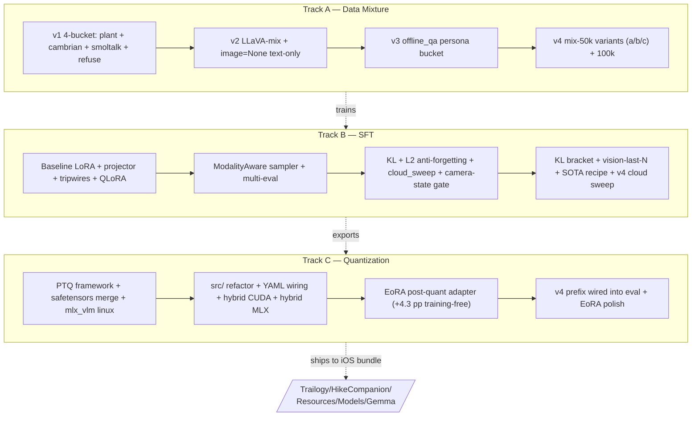
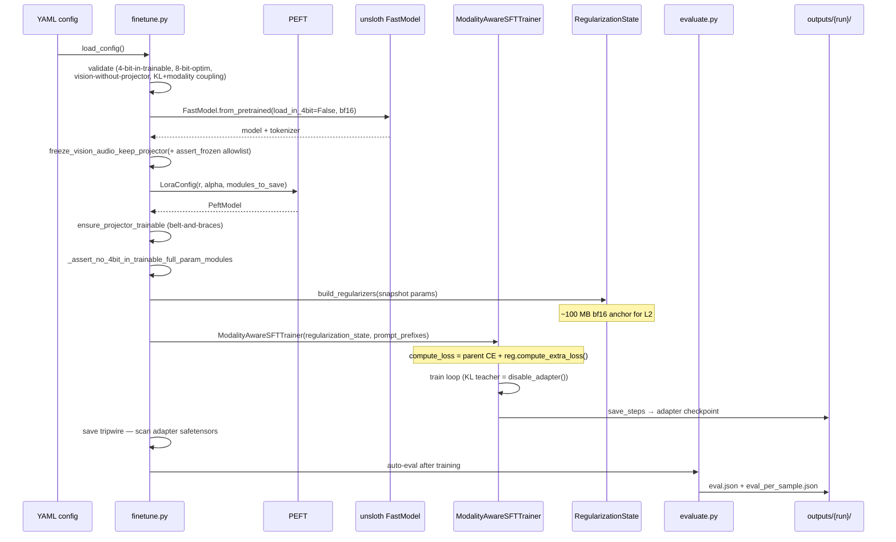
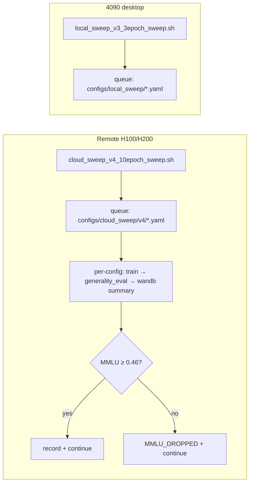
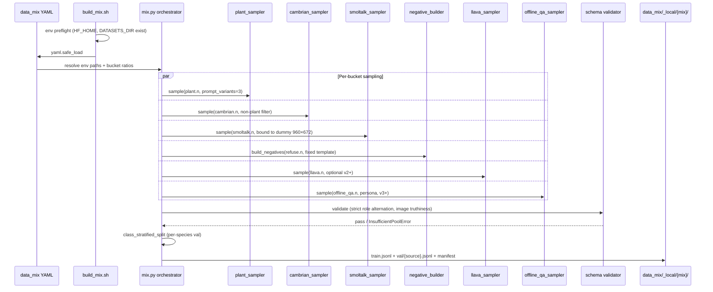
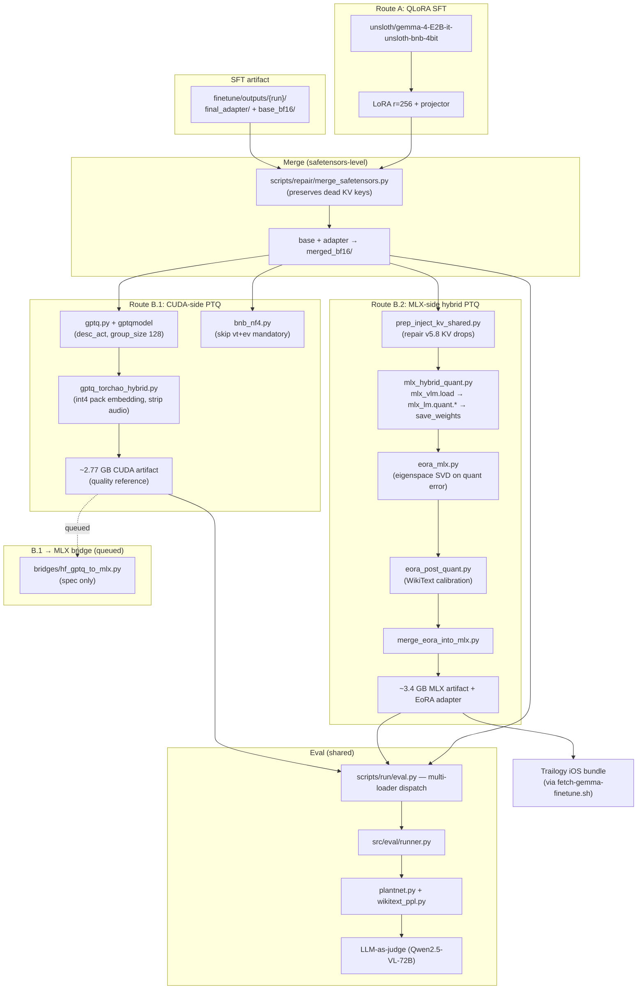
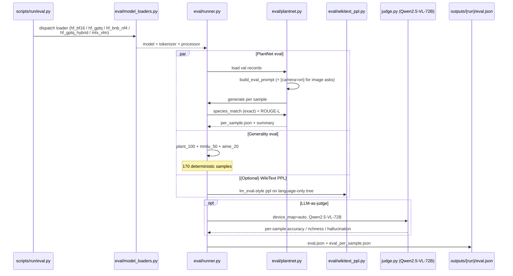
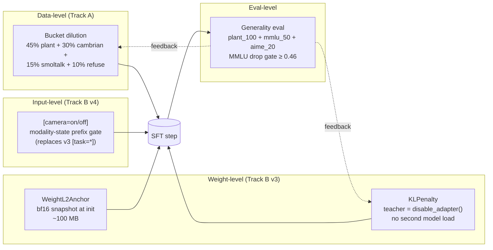

# Model-Side Architecture Overview

## TLDR

End-to-end pipeline turning stock `unsloth/gemma-4-E2B-it` into an SFT'd, quantized checkpoint that ships under iOS's ~4 GB jetsam ceiling while keeping >=46% MMLU and >=60% PlantNet match. Three parallel tracks (`data_mix/`, `finetune/`, `quantization/`) share one eval surface and land the artifact in the iOS bundle's `Models/Gemma/`.

End-to-end model pipeline that turns stock `unsloth/gemma-4-E2B-it`
into an SFT'd, data-mixed, deploy-quantized checkpoint that ships
inside the Trailogy iOS bundle under the ~4 GB jetsam ceiling, retains
≥ 46 % MMLU (no catastrophic forgetting), and answers
PlantNet-style plant-ID questions at ≥ 60 % match.

For the iOS-side architecture (consumer of this pipeline's deploy
artifact), see [`02-architecture-ios-app.md`](02-architecture-ios-app.md).

## Three modules

Three Python packages sit side-by-side in the repo:

| Module | Purpose | Active phase |
|---|---|---|
| [`data_mix/`](../../src/data_mix/) | Multi-bucket dataset assembly (plant + cambrian + smoltalk + refuse / LLaVA / offline_qa) | Track A |
| [`finetune/`](../../src/finetune/) | SFT pipeline — LoRA + `modules_to_save`, KL/L2 anti-forgetting, ModalityAware sampler, eval | Track B |
| [`quantization/`](../../src/quantization/) | PTQ + MLX deploy quant + EoRA post-quant adapter | Track C |

All three share the same `src/` layout, `pytest.ini` shape, and
`scripts/run | inspect | repair | _env/` structure.

## Three workstreams (parallel)

The three tracks **share the eval surface** — same
`finetune/src/evaluate.py`, same `quantization/src/eval/plantnet.py`,
same Qwen judge, same deterministic generality eval (`plant_100 +
mmlu_50 + aime_20`). See [`10-eval-setup.md`](10-eval-setup.md) for the
shared eval contract and its caveats.

## Hardware

| Class | Role |
|---|---|
| 4090 desktop (24 GB) | Dominant SFT + CUDA-side PTQ host; `local_sweep` |
| 4090 laptop (16 GB) | `local_sweep_v2` (smaller batch) |
| 2× A100 (40 GB) | Parallel config sweeps |
| H100 / H200 cloud (remote GPU box) | `cloud_sweep`, big-batch + KL ablations, eval during training |
| Apple Silicon (M-series Mac) | MLX-native quant (Track C.2 hybrid) + EoRA calibration |

Cross-validation between CUDA and MLX eval backends works in either
direction since the from-source `mlx-cuda` fix
([`11-cuda-vs-mlx-eval-parity.md`](11-cuda-vs-mlx-eval-parity.md)).

## Core data flow — SFT (Track B)

The hot path: `prepare_*.sh → finetune.py → export_mlx.py` chained by
`scripts/run/{train, export, sweep_eval_*}.sh`. The
`ModalityAwareSFTTrainer` is a thin subclass of TRL's `SFTTrainer`
that (a) batches by modality (no cross-modal batches), (b) wraps
`compute_loss` with `reg_state.compute_extra_loss()` when KL/L2 are
enabled, and (c) hooks `Trainer.log()` to drain a rolling reg_kl /
reg_l2 metric buffer every `logging_steps`.

### Sweep harness

The cloud sweep ports the same SOTA recipe (`r=8 / α=8 / no-KL` with
vision-last-2) to the 4090 via local-sweep config. Glob-based queue —
drop a new YAML → re-launch with `STAGE_RESUME=1` and only the new
config runs.

## Core data flow — data mixture (Track A)

Samplers share a 960×672 stretch-resize helper that mirrors
`prepare_plantnet.py`, so visual feature distribution matches training-
time and deploy-time `mlx-swift-lm` (see
[`13-mlx-vision-input-parity.md`](13-mlx-vision-input-parity.md)).

### Mix versions

| Version | Buckets | Configs | Key change |
|---|---|---|---|
| v1 | plant + cambrian + smoltalk + refuse | `mix-200.yaml`, `mix-20k.yaml` | initial 4-bucket scaffold |
| v2 | + LLaVA, + `image=None` text-only path | `mix-200-llava.yaml` | multi-val output (per-bucket val) |
| v3 | + offline_qa persona | (folded into mix-50k variants) | tour-guide voice, no image |
| v4 | per-trail-tuned ratios | `mix-50k.yaml`, `mix-50k-b.yaml`, `mix-50k-c.yaml`, `mix-100k.yaml` | smoltalk +5pp A/B, mixc text variant |

## Core data flow — quantization (Track C)

**Why both routes**: Route A (QLoRA SFT on bnb-4bit base) tests the
direct-tune-on-4-bit hypothesis cheaply (~3× faster wall) and
produces a strong CUDA-side bnb-NF4 result (69.5 % @ 6.52 GB), but
the MLX deploy step collapses badly because `mlx_vlm.convert`'s
data-free affine quantizer can't recover. **Route B.2 (hybrid MLX +
EoRA) closes most of that gap** — EoRA r=64 closes +4.3 pp on M2
subset (83.7 % → 88.0 %, within bf16 noise) with zero gradient descent.

See [`../quantization/README.md`](../quantization/README.md) for the
per-route detail.

## Core data flow — eval (shared across tracks)

Same `eval.py` runs on `hf_bf16`, `hf_gptq`, `hf_bnb_nf4`,
`hf_gptq_hybrid`, and `mlx_vlm` loaders — single CLI, dispatched by
loader name. The v4 `[camera=on/off]` prefix is wired into both
PlantNet eval (`300d52e`) and text-only generality domains (`e98ec18`)
so v4-trained checkpoints aren't evaluated under a v3 prompt shape.

## Anti-forgetting stack (Track B v3+)

**Three independent attack surfaces on catastrophic forgetting**:

1. **Data**: dilute the plant signal at training-data assembly.
2. **Weight**: KL anchor (teacher = same model under
   `disable_adapter()` — zero extra GPU memory) + L2 anchor (param-
   at-init snapshot — for LoRA delta params ≈ weight decay; for
   `modules_to_save` full-rank params it's genuine EWC-style "stay
   close to pretrained").
3. **Input**: gate the fine-tune behavior on a modality-state prefix
   the model learns to associate with task. iOS app applies the
   matching prefix at inference.

Eval (the 4th surface) closes the loop with a deterministic 170-sample
generality eval after every cloud sweep run; `MMLU < 0.46` configs get
`MMLU_DROPPED` in the summary. See
[`../finetune/03-anti-forgetting-and-final-recipe.md`](../finetune/03-anti-forgetting-and-final-recipe.md)
for the detailed design and why rank=8/α=8/no-KL won.

## Tripwire inventory

| Tripwire | Where | Catches |
|---|---|---|
| `assert_frozen` allowlist | `freeze.py` | non-allowlisted frozen-token params un-frozen |
| `ensure_projector_trainable` / `ensure_vision_layers_trainable` | `freeze.py` | PEFT silently drops `modules_to_save` |
| `_assert_no_4bit_in_trainable_full_param_modules` | `finetune.py` | `bnb.Params4bit` in trainable (breaks projector tuning) |
| `_assert_no_8bit_optim` | config validator | `adamw_8bit` bleeding into bf16 SFT |
| Save tripwire | `finetune.py` post-save | adapter safetensors header missing tuned tensors |
| Export tripwire (vision tower) | `export_mlx.py` | `AutoModelForCausalLM` drops `vision_tower` / `embed_vision` |
| Export tripwire (projector-changed byte-diff) | `export_mlx.py` | PEFT silently fails to restore `modules_to_save` |
| `inspect_vision_dtype` | `quantization/scripts/inspect/` | `vision_tower` bf16 invariant violated |
| Orphan-tensor smoke | `save_reload_check.py` | `transformers` k_proj/v_proj drop on KV-shared layers (see [`15-postmortems.md`](15-postmortems.md) §1) |
| `_mlx_dir_has_vision_weights` | `export_mlx.py` | `mlx_lm.convert` (language-only) used instead of `mlx_vlm.convert` |
| YAML config round-trip test | `tests/test_run_quant_yaml.py` | YAML knobs that aren't actually loaded |
| `CalibrationDataLeakError` | `quantization/src/common/calibration.py` | calibration overlap with eval set |
| `prep_inject_kv_shared` preflight | `prep_inject_kv_shared.py` | `mlx_vlm.load` "Missing 60 parameters" on v5.8 saves |

## Deploy artifact → iOS bundle

The final MLX checkpoint lands at
`Trailogy/HikeCompanion/Resources/Models/Gemma/` via the iOS app's
`scripts/fetch-gemma-finetune.sh` (gated HF download). The iOS app
then:

1. Auto-backs-up the stock model to `Models/Gemma.stock/` on first
   swap (so reverting is one `mv`).
2. Patches `processor_config.json` to `size: 960×672` (the trained
   pooler shape — see [`13-mlx-vision-input-parity.md`](13-mlx-vision-input-parity.md)).
3. Loads via `mlx-swift-lm` in `.vlm` mode (~2.78 GB MLX active +
   ~3.54 GB peak during VLM prefill).
4. Emits the `[camera=on]` SFT data-prefix gate on every image Ask —
   matches the Track B v4 training-time input distribution.

The deploy size budget is locked by the **~4 GB iOS jetsam ceiling**.
`mlx-community/gemma-4-e2b-it-4bit` ≈ 3.58 GB on disk; our SFT'd MLX
g128 artifact lands ~3.3 GB; with the EoRA adapter folded in,
deployable artifact is ~3.4 GB. Quantization memory math (bytes/weight
derivation, why g128 is the sweet spot for the iOS budget) is in
[`03-memory-management.md#quantization-memory-math`](03-memory-management.md#quantization-memory-math).

## Technology stack

| Layer | Technology |
|---|---|
| Training framework | `transformers ≥ 5.8` + `peft 0.19.1` + `trl 1.4.0` + `unsloth 2026.5.2` |
| 4-bit base loader | `bitsandbytes` (Route A QLoRA only) |
| CUDA PTQ | `gptqmodel 7.0.0` (Marlin / ExLlamaV2 / Machete kernels) |
| CUDA PTQ — embedding pack | `torchao` (`IntxWeightOnlyConfig` int4 g128) |
| MLX deploy quant | `mlx_vlm` (`mlx_vlm.convert -q`) |
| MLX research quant | `mlx_lm.quant.{gptq, awq, dwq, dynamic_quant}` |
| MLX post-quant adapter | EoRA (pure MLX, no PyTorch dep) — `eora_mlx.py` |
| Optimizer | `adamw_torch_fused` (8-bit optim REJECTED at config-validate) |
| Eval — exact | species_match + ROUGE-L + WikiText PPL |
| Eval — generality | plant_100 + mmlu_50 + aime_20 (deterministic) |
| Eval — judge | Qwen2.5-VL-72B (device_map=auto, structured JSON) |
| Sweep infra | bash glob queues + wandb auto-stream + MMLU drop gate |

See [`14-package-versions-and-known-bugs.md`](14-package-versions-and-known-bugs.md)
for the tested version matrix and known bugs in each layer.

## Per-module entry points

| Module | Entry point | Inputs | Outputs |
|---|---|---|---|
| `data_mix/` | `build_mix.sh <config>` | YAML + HF/disk sources | `_local/<mix>/train.jsonl` + `val/<source>.jsonl` |
| `finetune/` | `train.sh <config>` | YAML + base HF model + data_mix output | `outputs/<run>/{final_adapter, base_bf16, eval.json, checkpoints/}` |
| `quantization/` | `quant.py --config <yaml>` | merged bf16 model | `results/<method>/<run>/model.safetensors + config.json + processor_config.json` |
| Eval (shared) | `eval.py --config <yaml> --loader <name>` | any saved model + eval set | `eval.json + eval_per_sample.json` |

## Cross-references

- iOS-side architecture: [`02-architecture-ios-app.md`](02-architecture-ios-app.md)
- Memory management (iOS) + quantization memory math: [`03-memory-management.md`](03-memory-management.md)
- Model dev timeline: [`08-dev-timeline-model.md`](08-dev-timeline-model.md)
- Per-module READMEs: [`../data_mix/README.md`](../data_mix/README.md), [`../finetune/README.md`](../finetune/README.md), [`../quantization/README.md`](../quantization/README.md)
- Eval setup: [`10-eval-setup.md`](10-eval-setup.md)
