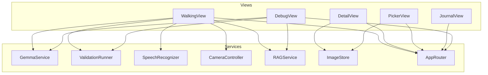
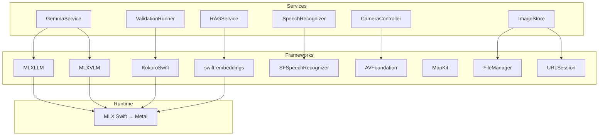
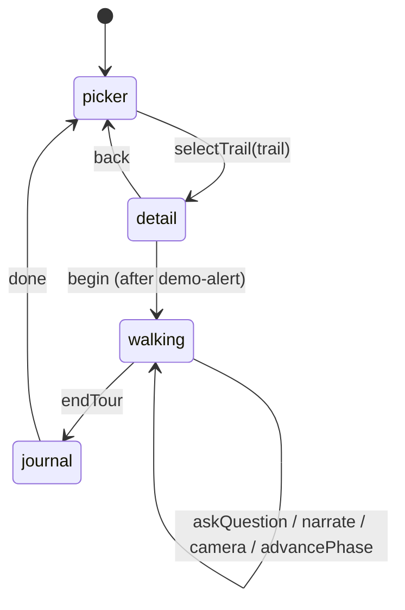
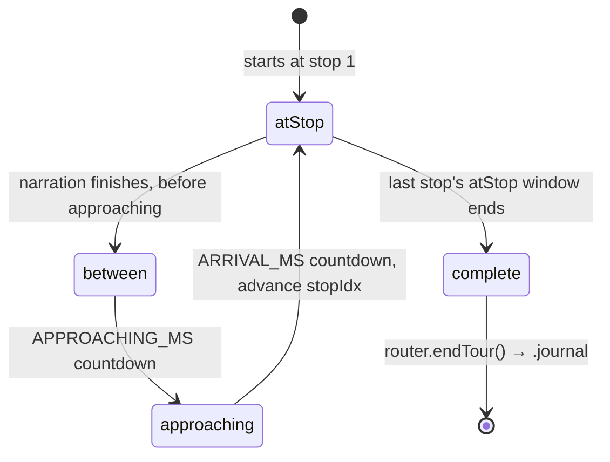
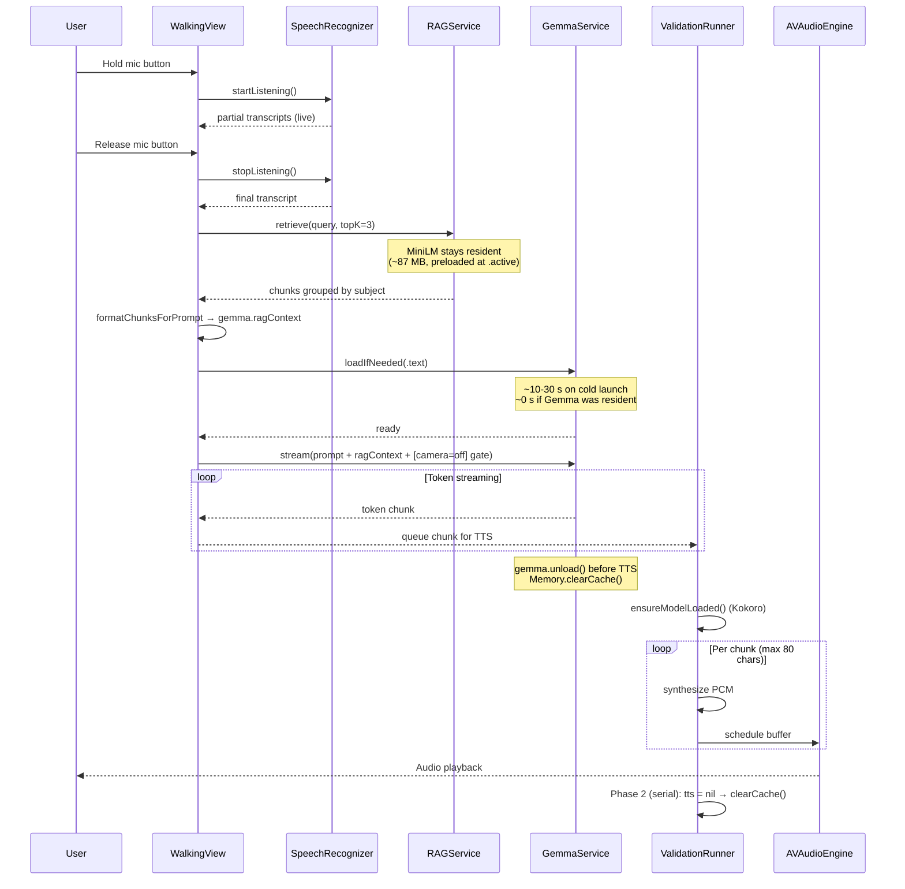
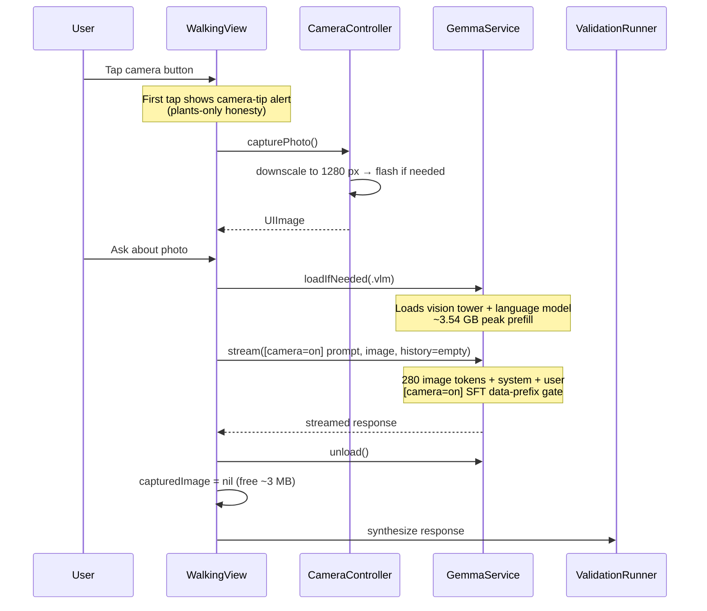
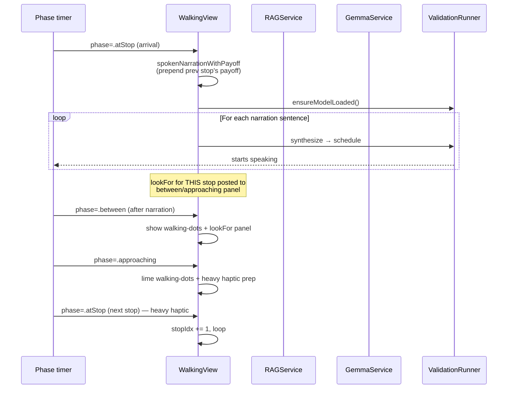
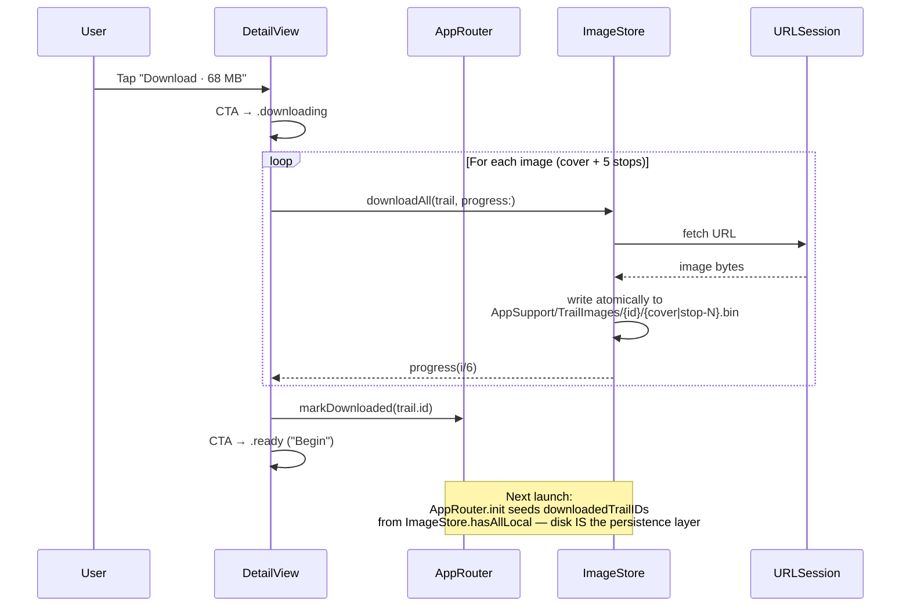
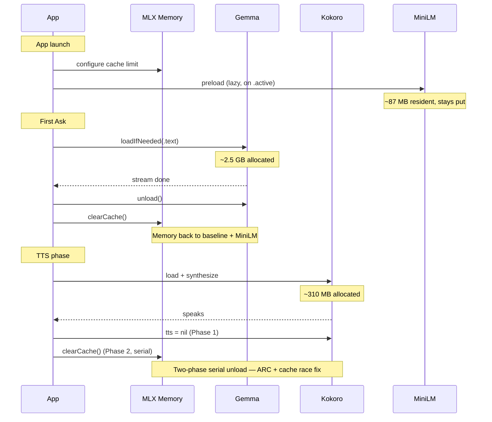

# iOS App Architecture (Trailogy)

## TLDR

Architecture of the Trailogy iOS app: an offline trail guide running Gemma 4 E2B INT4 (LLM/VLM), Kokoro 82M (TTS), SFSpeechRecognizer (STT), and MiniLM-L6-v2 (RAG) on-device, no network at runtime. Total ~3.4 GB installed. SwiftUI views call services owned by `ContentView`; `WalkingView` is the only view driving ML inference.

Architecture overview for the iOS app side of Trailogy. For the
model-side pipeline (consumer of which is this app's `Models/Gemma/`),
see [`01-architecture-model-pipeline.md`](01-architecture-model-pipeline.md).

> Repo identity: display name **Trailogy**; the Xcode target / bundle
> id / source directory stay `HikeCompanion` internally to avoid
> provisioning churn — the rename was a single `CFBundleDisplayName`
> change.

## Product summary

Trailogy is an iOS app for the Kaggle Gemma 4 for Good hackathon. A
self-guided audio trail guide for three trails: walks the user through
pre-authored stop narration, accepts voice + photo questions, and
recalls grounded answers via on-device retrieval. **Everything runs
on-device with zero network at run time:**

- **Gemma 4 E2B** (INT4, ~2.8 GB) — LLM / VLM. Optionally swappable
  to the SFT'd finetune produced by the model-side pipeline.
- **Kokoro 82M** (FP32, ~310 MB active) — Text-to-Speech.
- **SFSpeechRecognizer** (Apple, on-device) — Speech-to-Text.
- **MiniLM-L6-v2** (FP32, ~87 MB) — sentence embeddings for RAG retrieval.
- **Trail content + RAG corpus + cover/stop photos** bundled in the
  `.app` (no first-launch download).

Total on-device footprint: **~3.4 GB** installed
(Gemma INT4 ~2.8 GB + Kokoro ~0.31 GB + MiniLM ~0.09 GB + RAG corpus
~0.02 GB + Swift binaries + assets). Doubles to ~6.2 GB if the user
keeps the stock Gemma backup in `Models/Gemma.stock/` alongside an
SFT'd finetune in `Models/Gemma/` (Phase 7 fetch-and-backup flow).

## High-level architecture

### Layer 1 — Views → Services (who calls what)



`ContentView` owns all services (`GemmaService`, `ValidationRunner`,
`SpeechRecognizer`, `RAGService`, `AppRouter`, `ImageStore`) as
`@StateObject`. `AppRouter` drives navigation. **`WalkingView` is the
only view that drives ML inference**; the other views read shared
state (downloadedTrailIDs, walkedAt, RAG subjects override) and
render UI.

### Layer 2 — Services → Frameworks (what powers what)



**Four MLX consumers** (Gemma, Kokoro, MiniLM, vendored shaders) share
one Metal runtime, one allocator, one cache. Hand-off discipline
(unload-before-load, two-phase serial unload, scenePhase gates — see
[`03-memory-management.md`](03-memory-management.md) and
[`06-scenephase-metal-background.md`](06-scenephase-metal-background.md))
is the architectural fact that makes the entire stack fit.

## App state machine (AppRouter)



States:
- **picker** — Trail selection home (3 cards). Each card carries
  downloaded + completed badges.
- **detail** — Trail info + state-aware Download CTA + Begin button
  (gated by demo-mode alert).
- **walking** — Active tour. Has its own internal `TourPhase` machine
  (below).
- **journal** — Post-tour Recap (Discoveries stream).

### Internal tour state machine (`WalkingView.TourPhase`)



- **atStop** — narration playing (Kokoro streaming) + look-for /
  payoff arc rendered + mic / camera / more visible.
- **between** — walking-dots animation, prev stop's lookFor visible.
- **approaching** — heavy haptic, lime walking-dots + glow.
- **complete** — terminal; completion card + "Open journal" CTA.

Backgrounding the app from `.atStop` / `.approaching` halts Kokoro
synth via `scenePhase` `.onChange` — prevents Metal command-buffer
submission while the app is backgrounded (see
[`06-scenephase-metal-background.md`](06-scenephase-metal-background.md)).

## Core data flow — Ask pipeline (with RAG injection)



## Core data flow — VLM (image) Ask



VLM path **bypasses RAG** (image-Q is closed-form on the photo
content) and **bypasses chat history** (cold context to keep KV cache
small). `[camera=on]` is emitted by `GemmaService` to match the
training-time input marker (Track B v4) — see
[`14-package-versions-and-known-bugs.md`](14-package-versions-and-known-bugs.md)
for why preserving the SFT input marker at inference matters.

## Core data flow — tour-guide narration (streaming TTS)



Narration is RAG-augmented per-stop (the active subjects set is
populated from `trail.defaultRAGSubjects` at tour start, then
narration prompts pull top-k chunks). User Asks (mic or camera)
interrupt narration; on resume, the remaining sentences continue from
the interrupt point.

## Core data flow — offline image cache



`CachedTrailImage` is the drop-in for `AsyncImage`. Tries
`ImageStore.loadLocal` first; falls back to network `AsyncImage`.
`.task(id:)` re-checks disk so images downloaded after first render
take over without manual invalidation.

## Service responsibilities

| Service | Model / Backing | Active mem | Role |
|---|---|---|---|
| `GemmaService` | Gemma 4 E2B INT4 (stock or SFT) | ~2.5 GB text, ~3.5 GB peak VLM prefill | Text gen, multimodal vision, `[camera=on/off]` gate, offline-aware system prompt |
| `ValidationRunner` | Kokoro 82M FP32 | ~310 MB active | TTS synthesis with streaming chunks |
| `SpeechRecognizer` | Apple built-in | 0 MB (system) | On-device ASR |
| `RAGService` | MiniLM-L6-v2 + bundled corpus | ~87 MB resident | Multi-subject top-k retrieval, query-once-scan-all |
| `CameraController` | — | — | Photo capture + 1280-px downscale + auto-flash |
| `ImageStore` | Disk cache + URLSession | ~9 MB/trail on disk | Per-trail cover + stop image cache, atomic write |
| `AppRouter` | In-memory state | trivial | Nav + downloadedTrailIDs + walkedAt + ragSubjectsOverride |

## RAG architecture (preview)

Full details in [`05-rag-runtime.md`](05-rag-runtime.md). Short
version:

- MiniLM (~87 MB FP16, bundled — no first-launch HF download)
  preloaded at `.active`, resident across the Gemma load/unload cycle.
- 4 subject corpora (geology / plants / physics / english), each ~25
  hand-authored chunks, pre-embedded at build time, bundled in `.app`.
- Per-trail `defaultRAGSubjects` selects which corpora are active;
  DebugView can override at runtime.
- Per-Ask: embed query (~5 ms) → cosine vs every active subject's
  chunks (~1 ms) → top-k → `formatChunksForPrompt` groups by subject
  → injected into Gemma's user prompt one-shot.

### RAG vs VLM mode selection

| Ask type | Path | RAG injected? | History? |
|---|---|---|---|
| Text Q (mic) | `.text` | Yes (active subjects) | 20 messages (10 turns: 10 user + 10 assistant) |
| Image Q (camera) | `.vlm` | **No** (cold context) | **None** (cold context) |
| Tour narration (auto) | `.text` | Yes (active subjects) | None per-stop |

## Memory discipline (preview)

Full numbers in [`03-memory-management.md`](03-memory-management.md).
Short version:



**The three hand-off discipline rules** (each born from a real Phase
1 bug):

1. **Unload Gemma BEFORE TTS** — both resident > 5 GB → jetsam.
2. **Two-phase serial Kokoro unload** — `tts = nil` and
   `clearCache()` must be in separate `workQueue` phases; local
   closure bindings hold refs until the closure exits.
3. **scenePhase gate on every MLX allocator activity** — preload,
   synth, streaming all guarded against `.background` (see
   [`06-scenephase-metal-background.md`](06-scenephase-metal-background.md)).

## Project directory structure

```
Trailogy/                                # repo root (display name)
├── HikeCompanion/                       # source directory (legacy name)
│   ├── HikeCompanionApp.swift           @main, MLX config
│   ├── ContentView.swift                Root view, owns services
│   ├── AppRouter.swift                  Nav state machine + downloadedTrailIDs +
│   │                                    walkedAt + ragSubjectsOverride
│   ├── GemmaService.swift               LLM/VLM lifecycle, [camera=on/off] gate,
│   │                                    offline-aware system prompt
│   ├── ValidationRunner.swift           TTS lifecycle + chunking
│   ├── SpeechRecognizer.swift           ASR wrapper
│   ├── CameraController.swift           Photo capture + downscale + auto-flash
│   ├── RAGService.swift                 Multi-subject retrieval
│   ├── ImageStore.swift                 On-disk image cache
│   ├── MemoryStats.swift                Memory monitoring
│   ├── TrailData.swift                  Trail catalog + stops + learnings +
│   │                                    defaultRAGSubjects + lookFor/payoff +
│   │                                    CLLocationCoordinate2D coords
│   ├── Theme.swift                      Design tokens
│   ├── HikeCompanion.entitlements       Mic + Camera + Speech entitlements +
│   │                                    increased-memory-limit
│   ├── Info.plist                       CFBundleDisplayName=Trailogy + permissions
│   ├── Views/
│   │   ├── WalkingView.swift            Active tour
│   │   ├── PickerView.swift             Trail selection
│   │   ├── DetailView.swift             Trail info + Download CTA + MapKit preview
│   │   ├── JournalView.swift            Recap (Discoveries + trailmark + 9-cat icons)
│   │   ├── CameraView.swift             Camera modal
│   │   ├── CameraPreviewView.swift      AVCapturePreviewLayer
│   │   ├── TourMapView.swift            In-tour map overlay (MapKit)
│   │   ├── TrailMapShape.swift          Native MapKit TrailMapView
│   │   ├── CachedTrailImage.swift       AsyncImage + disk cache
│   │   └── DebugView.swift              Developer console + RAG subject picker
│   ├── Assets.xcassets/                 AppIcon (Trailogy logo, full-bleed)
│   └── Resources/                       (gitignored where noted)
│       ├── Models/                      (gitignored, fetched by scripts)
│       │   ├── kokoro-v1_0.safetensors
│       │   ├── voices.npz
│       │   ├── Gemma/                   stock or finetune (swappable)
│       │   │   ├── config.json
│       │   │   ├── model.safetensors
│       │   │   └── processor_config.json (patched to 960×672)
│       │   └── MiniLM/                  bundled, ~87 MB
│       │       ├── model.safetensors
│       │       ├── tokenizer.json
│       │       └── config.json
│       └── RAG/                         bundled corpus
│           ├── manifest.json
│           ├── geology.jsonl  + .embeddings.f16
│           ├── plants.jsonl   + .embeddings.f16
│           ├── physics.jsonl  + .embeddings.f16
│           └── english.jsonl  + .embeddings.f16
├── external/
│   ├── kokoro-ios/                      Vendored KokoroSwift
│   ├── MisakiSwift/                     Vendored G2P
│   ├── MLXUtilsLibrary/                 Vendored utils (+ BenchmarkTimer stub)
│   └── mlx-swift-lm/                    Local copy for VLM debugging
├── rag-poc/                             Embed pipeline (Python)
├── scripts/
│   ├── fetch-models.sh                  Download Kokoro weights
│   ├── fetch-gemma.sh                   Download stock Gemma + patch config
│   ├── fetch-gemma-finetune.sh          Pull SFT finetune from gated HF
│   ├── strip-gemma-audio.py             Remove audio tower (~583 MB saved)
│   ├── generate-project.sh              xcodegen wrapper
│   ├── embed-rag-corpus.py              MiniLM batch embed → f16
│   ├── query-rag-corpus.py              Retrieval debug REPL
│   ├── switch-gemma.sh                  Variant-management
│   └── rag-requirements.txt
├── project.yml                          XcodeGen project definition
└── README.md
```

## Technology stack

| Layer | Technology |
|---|---|
| UI | SwiftUI (iOS 18+), MapKit |
| LLM/VLM | `mlx-swift-lm 3.x` (MLXLLM / MLXVLM) |
| TTS | `KokoroSwift 1.0.11` (MLX-based) |
| STT | Apple `SFSpeechRecognizer` (on-device) |
| Embeddings | `swift-embeddings` (MiniLM-L6-v2, MLX backend) |
| ML Runtime | MLX Swift 0.31+ → Metal |
| Camera | AVFoundation `AVCaptureSession` |
| Audio | `AVAudioEngine` + `AVAudioPlayerNode` |
| Image cache | `FileManager` (Application Support) + `URLSession` |
| Build | XcodeGen + SwiftPM |
| Target | iPhone 15 Pro+ (arm64, iOS 18+) |
| App size | ~3.4 GB installed (Gemma 2.8 + Kokoro 0.31 + MiniLM 0.09 + corpus 0.02 + Swift binaries + assets); doubles if `Gemma.stock` backup is kept alongside a finetune |

## Cross-references

- Model-side architecture (producer of `Models/Gemma/`):
  [`01-architecture-model-pipeline.md`](01-architecture-model-pipeline.md)
- Memory management deep-dive:
  [`03-memory-management.md`](03-memory-management.md)
- Xcode build + SPM dependency vendoring:
  [`04-xcode-build-and-deps.md`](04-xcode-build-and-deps.md)
- RAG runtime details:
  [`05-rag-runtime.md`](05-rag-runtime.md)
- scenePhase × Metal background pattern:
  [`06-scenephase-metal-background.md`](06-scenephase-metal-background.md)
- Optimization catalog:
  [`07-optimizations-and-future.md`](07-optimizations-and-future.md)
- iOS dev timeline:
  [`09-dev-timeline-ios.md`](09-dev-timeline-ios.md)
