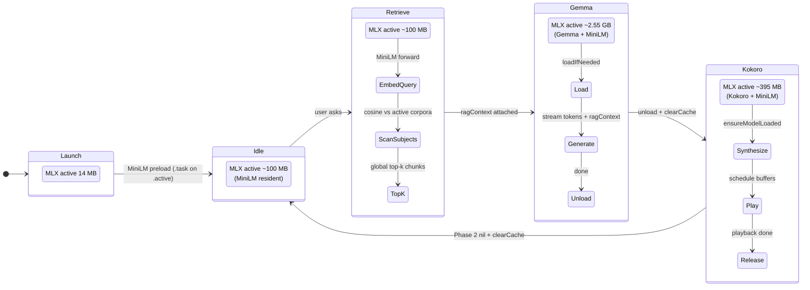
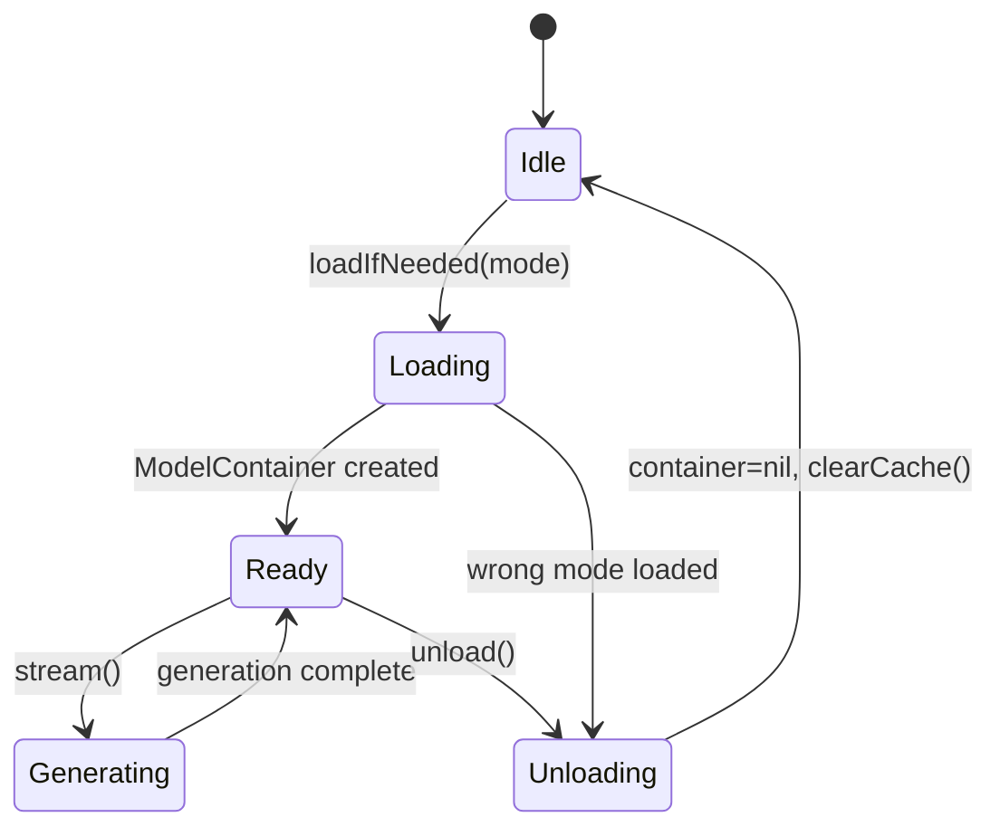
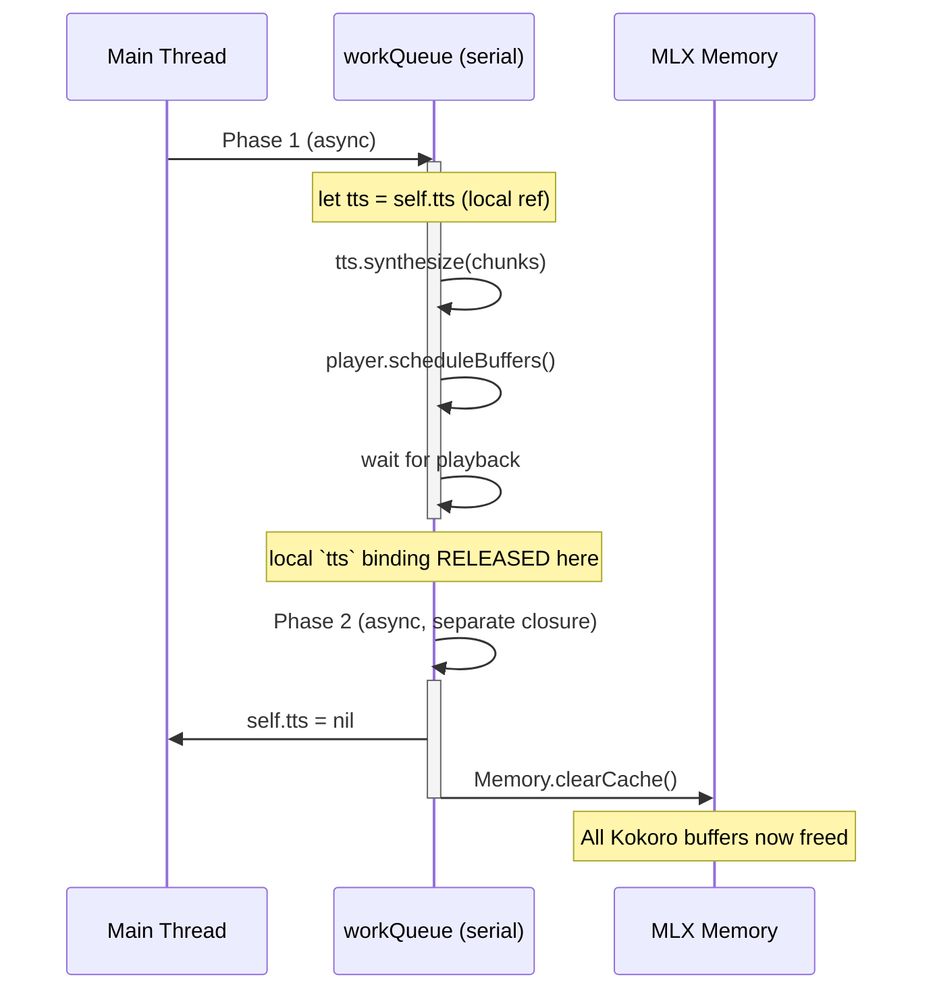
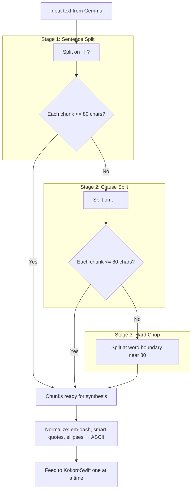

# Memory Management & iPhone Optimizations

## TLDR

iOS memory discipline under iPhone's ~5-6 GB jetsam threshold. Two rules: Gemma and Kokoro never coexist (load-per-use, unload before hand-off); MiniLM (~87 MB) stays resident. Trades 10-30s per-Ask reload latency for memory safety. Idle baseline is ~100 MB; text Ask peaks around ~3.0 GB, while VLM prefill can peak around ~3.85 GB.

iOS on-device memory discipline + the quantization memory math that
dictates the deploy artifact size.

Companion to [`02-architecture-ios-app.md`](02-architecture-ios-app.md)
(architecture overview), [`06-scenephase-metal-background.md`](06-scenephase-metal-background.md)
(C++/Swift Metal-backgrounding pattern), and [`05-rag-runtime.md`](05-rag-runtime.md)
(RAG retrieval details).

## Design philosophy

> **Time for Space** — Accept 10-30 s reload latency per Ask in
> exchange for guaranteed memory safety.

iPhone 15 / 17 Pro (12 GB RAM) jetsam threshold: **~5-6 GB** with the
`increased-memory-limit` entitlement. The app runs **two large models
that cannot coexist** plus **two always-resident small models**:

| Model | MLX Active | Peak | Lifecycle |
|---|---|---|---|
| Gemma 4 E2B INT4 | 2.47 GB | 2.97 GB (text) / ~3.85 GB (VLM prefill) | Load-per-Ask, unload before TTS |
| Kokoro 82M FP32 | ~310 MB | ~400 MB | Load-per-synth, two-phase serial unload |
| **MiniLM-L6-v2** (RAG) | **~87 MB** | ~95 MB | **Preloaded at `.active`, stays resident** |
| MapKit map tiles (cached) | ~10-25 MB | ~30 MB | On-demand per view, OS-managed |
| **Combined idle (Gemma OFF + Kokoro OFF + MiniLM ON)** | **~100 MB** | — | the steady-state baseline |
| Combined Gemma + MiniLM (during Ask) | **~2.55 GB** | ~3.0 GB | OK — MiniLM is rounding error |
| Combined Kokoro + MiniLM (during TTS) | ~395 MB | ~485 MB | OK |
| **Gemma + Kokoro (forbidden)** | **~2.8 GB** | **~3.4 GB** | **never permitted** — jetsam-margin eaten |

**Two layered rules**:

1. **Gemma and Kokoro never coexist** (jetsam-fix lineage).
2. **MiniLM stays resident** — ~87 MB is rounding error next to
   Gemma's 2.8 GB, and bundling avoided the first-launch HF download
   failure mode entirely.

## Memory lifecycle — complete Ask cycle (with RAG)



The cycle is a **near-closed loop**: every Ask starts and ends at Idle
(~100 MB), not 14 MB — MiniLM is the persistent baseline. Gemma and
Kokoro still never coexist with each other; both can coexist with
MiniLM because the ~87 MB cost is rounding error.

## Gemma service lifecycle



### Key design decisions

1. **Lazy load per Ask** — model NOT loaded at app launch.
2. **Dual mode** — `.text` (MLXLLM, ~2.47 GB) vs `.vlm` (MLXVLM,
   ~2.8 GB; ~3.85 GB prefill peak).
3. **Mode switch requires unload** — if wrong mode is loaded, unload
   first.
4. **History survives unload** — stored as plain `[Chat.Message]`,
   replayed into fresh `ChatSession`.
5. **History capped** — Text: 20 messages (10 turns: 10 user + 10 assistant); VLM: 0 messages
   (image tokens too large).
6. **`[camera=on/off]` SFT data-prefix gate** — `GemmaService`
   prepends the modality marker to match training-time input
   distribution. ~3 tokens, no measurable memory impact, prevents
   distribution drift on photo asks.
7. **Optional finetune swap** — `Models/Gemma/` can hold the stock
   4-bit checkpoint OR an SFT'd finetune. Same on-disk size + memory
   profile; the stock model auto-backs up to `Models/Gemma.stock/` on
   first swap.

## Kokoro TTS two-phase unload

The most subtle memory optimization in the codebase.



### Why two phases?

Root cause is **ARC release timing vs MLX cache semantics**:

| | Single block (WRONG) | Two serial blocks (CORRECT) |
|---|---|---|
| **Step 1** | `self.tts = nil` | Phase 1 closure exits normally |
| **Step 2** | `Memory.clearCache()` — cache emptied | ARC frees local `tts` binding (refcount → 0) |
| **Step 3** | Phase 1 closure exits | Phase 2 dispatched on same serial queue |
| **Step 4** | ARC frees local `tts` (was still alive!) | `self.tts = nil` |
| **Step 5** | Model buffers **re-enter** cache pool | `Memory.clearCache()` — all buffers freed |
| **Result** | Leaked buffers (cache cleared too early) | Clean (nothing alive when cache clears) |

A `let tts = self.tts` local binding in the closure keeps the
KokoroTTS object alive until the closure **exits**. If you clear the
cache while the closure is still running, the eventual ARC release
puts buffers back into a cache that will never be cleared again.

## MLX configuration

```swift
// HikeCompanionApp.swift init()
Memory.cacheLimit = 100 * 1024 * 1024  // 100 MB cache limit ONLY
// NO Memory.memoryLimit set
```

### Why no memoryLimit?

| Scenario | What happens at Gemma→Kokoro hand-off | Outcome |
|---|---|---|
| **With `memoryLimit`** | Gemma unloads → cache cleared → Kokoro loads → MLX hits hard ceiling mid-allocation → forced to stall/fragment on the critical path → iOS jetsam timer fires | **Crash** |
| **Without `memoryLimit`** | Gemma unloads → cache cleared → Kokoro loads → MLX freely sizes its arena → steady growth well under jetsam | **Stable** |

A hard `memoryLimit` forces MLX to try to reclaim from a cache that's
already empty (we just cleared it), causing allocation pressure spikes
that look like a memory leak to iOS's jetsam daemon.

### Entitlement

```xml
<!-- HikeCompanion.entitlements -->
<key>com.apple.developer.kernel.increased-memory-limit</key>
<true/>
```

Raises jetsam threshold from ~3.5-4 GB to ~6 GB on iPhone Pro models.

## Quantization memory math

The runtime / storage view of the numbers Track C produces (see
[`01-architecture-model-pipeline.md`](01-architecture-model-pipeline.md)
and [`../quantization/00-quantization-report-pub.md`](../quantization/00-quantization-report-pub.md)).

### Storage of a 4-bit affine quantized linear

For an `(out, in)` `Linear`, weights are grouped into runs of `g`
along the in-dimension. Each group ships three sidecars:

| Field | dtype | shape | bytes |
|---|---|---|---|
| `weight` (packed) | uint32 (8 weights / u32) | `(out, in/8)` | `0.5 · out · in` |
| `scales` | bf16 | `(out, in/g)` | `2 · out · in / g` |
| `biases` | bf16 | `(out, in/g)` | `2 · out · in / g` |

Bytes-per-weight:

$$\frac{1}{2} \;+\; \frac{4}{g}$$

Or equivalently, **bits-per-weight = 4 + 32/g**:

| g | bytes/weight | bits/weight |
|---|---|---|
| 128 | 0.531 | **4.25** |
| 64  | 0.562 | **4.50** |
| 32  | 0.625 | **5.00** |
| 16  | 0.750 | **6.00** |

`g=32` carries twice the scales+biases metadata of `g=64`, so it pays
an extra **0.5 bit/weight**. The metadata cost dominates as `g`
shrinks — at `g=16` the model is effectively 6-bit, not 4-bit.

### Applied to Gemma 4 E2B

The quantized footprint is ≈ `language_model`'s ~2.6 B parameters.
The vision tower, audio tower, embed_vision, RMSNorms, and embedding
tables stay **bf16** (Track C tripwire `inspect_vision_dtype` enforces
this).

| Variant | Quantized portion | + bf16 portion (~1 GB) | Measured size |
|---|---|---|---|
| M1 g128 | 2.6 B × 4.25 bit ≈ 1.38 GB | + ~1 GB | **~3.3 GB** |
| M2 g64  | 2.6 B × 4.50 bit ≈ 1.46 GB | + ~1 GB | **~3.4 GB** |
| M3 g32  | 2.6 B × 5.00 bit ≈ 1.63 GB | + ~1 GB | **~3.6 GB** |
| bf16 reference | 5.2 GB (2.6 B × 2 B) | + ~4.4 GB (full bf16) | **9.6 GB** |

The 0.2 GB step between g128 / g64 / g32 is almost entirely the
scales+biases metadata doubling.

### Why not always pick the smallest g

Small `g` → more metadata bytes → **but higher quantization quality**:
each smaller group has a tighter `max/min` range, so the per-group
`scale` is more accurate, and per-weight reconstruction error
shrinks. The trade-off is **fidelity vs size**:

| g | bits/weight | PlantNet (M2 subset) | Notes |
|---|---|---|---|
| 128 | 4.25 | 83-85 % | smallest, used by the shipped SFT finetune |
| 64  | 4.50 | 83-86 % | + EoRA r=64 → **88.0 %** (within bf16 noise) |
| 32  | 5.00 | 85-87 % | quality recovery without EoRA, +0.2 GB cost |
| 16  | 6.00 | ≥ 87 %  | crosses out of the "true 4-bit" regime |

### iOS budget consequences

The **~4 GB iOS jetsam ceiling** dictates the choice. M1 g128 ships
with ~0.7 GB headroom for VLM prefill activations + Kokoro + MiniLM
co-residents; M2 g64 leaves ~0.6 GB; M3 g32 leaves ~0.4 GB which is
inside the VLM prefill spike envelope (~700-900 MB of prefill
activations measured). **g128 + EoRA r=64** is the deploy sweet spot:
smallest on-disk size, post-quant adapter closes the quality gap,
leaves the most headroom.

### Activation memory (not stored, but allocated)

The Gemma "active" numbers include both the dequantized weights'
working set and the KV cache / activation buffers:

- **Weight working set**: MLX dequantizes on-the-fly per-block; the
  active dequant buffer ≈ 1-2 layers' worth, not the whole model. So
  a 3.3 GB on-disk g128 file occupies ~2.5 GB MLX-active during text
  generation (not 3.3 GB).
- **KV cache**: `maxKVSize × num_layers × num_kv_heads × head_dim ×
  2 (k+v) × 2 bytes (bf16)`. At `maxKVSize=1024` on Gemma 4 E2B this
  is ~120 MB — bounded by the generation-parameters budget below.
- **Activations (VLM prefill)**: ~3 MB per token of active context;
  scales with prompt length, **not** with model file size. Measured
  4.27 GB peak before prompt compression brought it back to ~3.85 GB.
  Activation memory is the reason iOS-side memory is spike-driven,
  not size-driven.

## Generation parameters budget

```swift
private let generationParameters = GenerateParameters(
    maxTokens: 120,
    maxKVSize: 1024,
    temperature: 0.7,
    prefillStepSize: 128
)
```

### KV cache size calculation

| Path | System prompt | Image tokens | History | User query | Generation | **Total** |
|---|---|---|---|---|---|---|
| **VLM** | ~200 (compressed) | 280 | 0 (dropped for VLM) | ~100 | 120 | **~700** |
| **Text** | ~200 (compressed) | — | ~360 (3 turns) | ~100 | 120 | **~740** |
| **Budget** | | | | | | **1024** |

Headroom: ~324 tokens (VLM), ~284 tokens (text).

Previous sizing history:
- KV 768 → app works but VLM gets clipped.
- KV 2048 → +1 GB peak memory, jetsam risk on VLM path.
- KV 1280 → worked, but VLM peak crept to ~4.27 GB after trail-context addition.
- KV 1024 → reclaims ~250-token allocation; prompt compression brings
  both paths well within budget.

## TTS chunking strategy



Why max 80 characters: Kokoro's duration predictor becomes unstable
above ~60 chars, producing high-pitch beep artifacts. 80 is the outer
safe bound.

## Camera image memory optimization

```
12 MP raw photo (~36 MB)
   → CGImage downscale (max 1280 px long edge)
   → Compressed UIImage (~3 MB)
   → Feed to Gemma VLM (960×672 resize internally)
   → Clear capturedImage after answer
```

## RAG memory discipline

| Component | Size | When |
|---|---|---|
| MiniLM model weights | ~87 MB | always (post-preload) |
| MiniLM activations (query embed) | < 1 MB | transient, per Ask |
| Per-subject `chunks` (text strings) | ~50-100 KB | while subject active |
| Per-subject `embeddings.f16` matrix | ~20-40 KB (`N×384×2 bytes`) | while subject active |
| Top-k scoring buffer | < 100 KB | transient, per retrieval |
| **Steady state with 2 active subjects** | **~87.3 MB** | the typical case |

Why MiniLM stays resident (and is small enough to):

- Per-Ask MiniLM cold start would be ~600 ms (model load + tokenizer)
  → would dominate the perceived Ask latency.
- ~87 MB fits everywhere — under Gemma (2.55 GB), under Kokoro
  (~395 MB), under idle (~100 MB).
- Bundling beats first-launch download — moved MiniLM from HF
  download-on-first-launch to bundled-in-`.app` because the
  first-launch path was fragile (network + opaque cache state).

See [`05-rag-runtime.md`](05-rag-runtime.md) for the full
implementation.

## Offline image cache (disk, not RAM)

| Layer | Size budget | Behaviour |
|---|---|---|
| Disk (`AppSupport/TrailImages/`) | ~9 MB per trail (cover + 5 stops) | persistent across launches; AppRouter reseeds `downloadedTrailIDs` from disk in `init` |
| `ImageStore.cache` (RAM) | OS-managed via `NSCache` | evicted under memory pressure; `CachedTrailImage` re-reads from disk |
| `MapKit` tile cache | OS-managed | only allocated while map view is on screen — neither DetailView preview nor TourMapView overlay overlaps with VLM-Ask window |

**Key memory invariant**: image cache is a **disk** optimization, not
a RAM one. `NSCache` lets the OS evict freely under pressure; the
disk read on miss is cheap (~9 MB on local SSD). Adding the offline
cache did not change the jetsam-margin math — the in-memory side is
OS-bounded and the disk side is bytes the app would have re-fetched
anyway from `AsyncImage`.

## Memory profile summary

| State | Process Footprint | MLX Active | MLX Peak | Jetsam Headroom |
|---|---|---|---|---|
| Cold start (pre-preload) | 41 MB | 14 MB | 14 MB | ~6 GB |
| MiniLM preloaded (.active) | ~190 MB | ~100 MB | ~100 MB | ~5.9 GB |
| Idle between Asks | ~190 MB | ~100 MB | — | ~5.9 GB |
| RAG retrieving (Ask in flight) | ~195 MB | ~100 MB | ~100 MB | ~5.9 GB |
| Gemma loaded (text) + MiniLM | ~2.75 GB | ~2.55 GB | ~3.05 GB | ~3.3 GB |
| Gemma generating (text) | ~2.85 GB | ~2.55 GB | ~3.05 GB | ~3.2 GB |
| Gemma loaded (VLM, prefill) | ~3.95 GB | ~3.85 GB | ~4.05 GB | ~2.0 GB |
| After Gemma unload | ~190 MB | ~100 MB | ~4.05 GB* | ~5.9 GB |
| Kokoro synthesizing + MiniLM | ~510 MB | ~395 MB | — | ~5.5 GB |
| After Kokoro unload | ~190 MB | ~100 MB | — | ~5.9 GB |
| + DetailView with MapKit | ~215 MB | ~100 MB | — | ~5.85 GB |
| + TourMapView overlay | ~225 MB | ~100 MB | — | ~5.85 GB |
| Backgrounded (.background) | ~50 MB | varies | — | OS-controlled |

*MLX peak is a lifetime high-water mark, not current allocation.

**The ~4 GB cliff** still exists on the VLM-prefill path. Phase 5's
prompt compression brought us back from ~4.27 GB; the camera-tip
honesty alert and the v4 SFT'd finetune (with tighter input
distribution) reduce both the prompt size and the prefill memory
further.

## Cross-references

- iOS architecture: [`02-architecture-ios-app.md`](02-architecture-ios-app.md)
- scenePhase Metal pattern: [`06-scenephase-metal-background.md`](06-scenephase-metal-background.md)
- RAG runtime: [`05-rag-runtime.md`](05-rag-runtime.md)
- Quantization design: [`../quantization/05-mlx-vlm-design.md`](../quantization/05-mlx-vlm-design.md)
- EoRA recovery: [`../quantization/B2-sft-results.md`](../quantization/B2-sft-results.md) (M8)
- Optimization catalog: [`07-optimizations-and-future.md`](07-optimizations-and-future.md)
