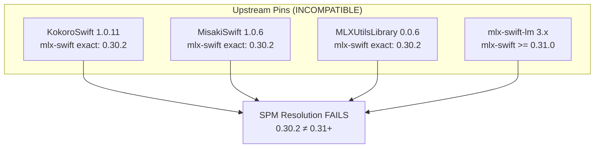
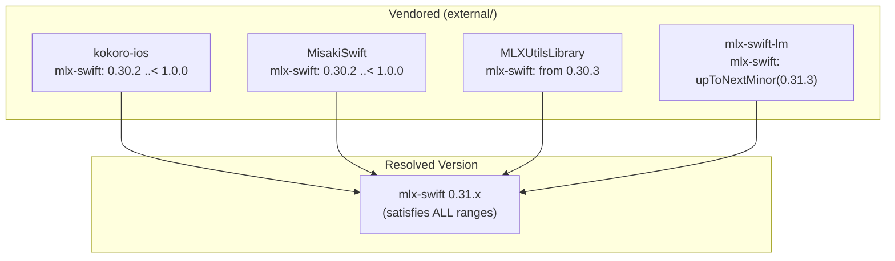

# Xcode Build Pipeline & Dependency Resolution

## TLDR

How Xcode propagates source/model/dep changes to the iPhone, plus the SPM conflict resolution for the vendored Kokoro + MLX stack. Key invariants: `Resources/Models/` is a blue-folder ref (recursive, no excludes, no symlinks on iOS); vendored `kokoro-ios`/`MisakiSwift`/`MLXUtilsLibrary` have relaxed MLX pins so `mlx-swift-lm 3.x` can coexist with KokoroSwift 1.0.11.

How the iOS build picks up source / model / dependency changes, plus
the SPM dependency conflict resolution for the vendored Kokoro / MLX
stack. Combines the two sides of "why does this iOS build fail" into
one doc.

## Part 1 — Xcode build & model refresh

### The pipeline in one diagram

```
[ macOS source tree ]                       [ Xcode build ]              [ iPhone / iPad ]

../gemma-variants/                          Compile sources              Diff-install:
├── default/        (3.4 GB, full)                                       only files with
└── no-audio/       (2.8 GB, stripped)                                   changed hashes
                                                                          are pushed
HikeCompanion/Resources/                                                  ↓
└── Models/                                 Copy Bundle Resources         /var/.../HikeCompanion.app/
    ├── Gemma/      ← cp -c clone of one    (recursive copy of            └── Models/
    │               variant + marker file    Resources/Models/ tree)          ├── Gemma/  (only the active one)
    ├── MiniLM/     (always bundled)                                           ├── MiniLM/
    ├── kokoro-v1_0.safetensors                                                ├── kokoro-v1_0.safetensors
    └── voices.npz                                                             └── voices.npz
```

Three caches sit between a source edit and what runs on the device:

1. **xcodegen output** — `HikeCompanion.xcodeproj` (stale if you
   added/removed/renamed source files or changed `project.yml`).
2. **Xcode DerivedData** — compiled `.o`, linked binary, copied
   resources.
3. **Device app sandbox** — what's actually installed on the iPhone.

A miss at any layer = "I rebuilt and nothing changed."

### How `Resources/Models/` reaches the device

#### `type: folder` blue-folder reference is recursive

In `project.yml`:

```yaml
sources:
  - path: HikeCompanion/Resources/Models
    type: folder      # NO `buildPhase: resources` — that flattens contents
```

`type: folder` makes Xcode treat the directory as one opaque
blue-folder reference. At build time Xcode walks the tree and copies
**every file inside, recursively, preserving the directory structure**,
into the `.app` bundle. There is **no excludes mechanism**.

**Practical consequence**: anything under
`HikeCompanion/Resources/Models/` ships to the device. A 3 GB stale
backup file. A second variant directory kept around for testing. A
`.bak` from a strip script. All of it.

#### iOS bundles do not tolerate symlinks

Earlier docs suggested symlinks for variant management. **That is
wrong on iOS.** What we observed:

- iOS code-signing (`codesign`) rejects `.app` bundles whose internal
  resources contain unresolved symlinks. macOS frameworks tolerate
  symlinks; iOS bundles do not.
- Even if signing accepts a resolved-symlink copy in some Xcode
  versions, the behavior is version-dependent.
- Runtime `Bundle.url(forResource:..., subdirectory:)` lookups behave
  differently on simulator vs device when symlinks are involved.

**Invariant: `HikeCompanion/Resources/Models/Gemma/` must be a real
directory.** No symlinks anywhere under `Resources/Models/`.

#### Variants live OUTSIDE the bundle path

```
hikeCompanion/                              ← repo root
└── HikeCompanion/Resources/Models/         ← bundled into .app
    └── Gemma/                              ← active variant only,
                                              real directory, real files

../gemma-variants/                          ← sibling of repo root,
├── default/                                  gitignored, NOT bundled
├── no-audio/
└── lora-plantnet-50k-r8-a8-lr2e4/
```

`scripts/switch-gemma.sh` materializes the active
`Resources/Models/Gemma/` as a copy of one of the
`gemma-variants/<name>/` directories. The other variants stay outside
the bundle path and are invisible to Xcode.

#### APFS clone makes the copy free

The materialization uses `cp -c -R` (APFS `clonefile(2)`). On the
default macOS data volume both source and destination are on the same
APFS container, so the active copy shares underlying blocks with the
variant — switching is instant and physical disk usage stays close to
"one copy of each variant", not "N+1 copies".

Falls back to plain `cp -R` on non-APFS filesystems.

#### `.active-variant` marker file

Inside `HikeCompanion/Resources/Models/Gemma/` the script writes a
tiny `.active-variant` file containing the variant name. This is how
`switch-gemma.sh` knows what's currently active without inspecting
file contents, and the safety check "refuse to destroy an unmanaged
`Models/Gemma/`" relies on the marker's absence to detect a directory
that was put there by something other than the switcher.

### Switching model variants — the reliable workflow

#### One-time setup

```bash
bash scripts/fetch-gemma.sh                       # downloads to Resources/Models/Gemma/
bash scripts/switch-gemma.sh --adopt default      # mv that into ../gemma-variants/default/
                                                  # then cp -c -R back into Resources/Models/Gemma/
                                                  # writes .active-variant: default
```

`--adopt` is the one-shot rescue mode for an unmanaged
`Resources/Models/Gemma/` directory.

#### Dropping in a finetuned variant

```bash
cp -c -R /path/to/mlx_export ../gemma-variants/lora-plantnet-50k-r8-a8-lr2e4
bash scripts/switch-gemma.sh lora-plantnet-50k-r8-a8-lr2e4
```

Variant names are arbitrary — dashes allowed. `switch-gemma.sh`
auto-detects everything matching `gemma-variants/*/`; nothing is
hardcoded.

#### What Xcode and the device need after a switch

With a `type: folder` blue reference these caches are fragile.
Symptoms we hit:

- Build succeeds, app launches, model loads with the **previous**
  variant's weights.
- "Unhandled keys" / "Missing key" errors mismatched against the
  variant the marker file says is active.

The reliable workflow when you've changed the variant:

```bash
bash scripts/switch-gemma.sh <variant>
bash scripts/generate-project.sh    # only if you also added/removed source files
```

Then in Xcode:

1. **Product → Clean Build Folder** (⇧⌘K) — invalidates DerivedData.
2. **Long-press the app on iPhone → Remove App** — forces a fresh
   install of the multi-GB model file. The only step that
   *guarantees* the new `model.safetensors` actually reaches the
   device.
3. ⌘R.

Re-pushes the entire model over the cable (~30 s for ~2.8 GB). Costs
the next cold-launch JIT pass (10-30 s for text-only, +3-5 s for VLM
path). It is the only fully reliable path.

#### Source-only changes

Editing `*.swift` and rebuilding does NOT need any of the above. Just
⌘R. Models are only re-copied when files inside `Resources/Models/`
change.

### When to regenerate the xcodeproj

`bash scripts/generate-project.sh` re-runs xcodegen from `project.yml`
(plus `project.local.yml` overrides if present). Run it when:

- You add, remove, or rename a `.swift` file under `HikeCompanion/` —
  xcodegen does NOT auto-pick those up.
- You edit `project.yml` (deps, build settings, capabilities,
  entitlements).

You do NOT need to regenerate when:

- Editing existing `.swift` files.
- Switching the active Gemma variant.
- Editing files inside `external/` vendored packages — SwiftPM picks
  those up via `path:` deps automatically.
- Files appearing or disappearing inside `Resources/Models/` — the
  blue-folder reference walks the directory at build time.

### Common "I rebuilt and it didn't change" causes

| Symptom | Cause | Fix |
|---|---|---|
| Wrong model weights at runtime after `switch-gemma.sh` | Xcode cached old Copy Bundle Resources output | Clean Build Folder + delete app from device, then ⌘R |
| "Unhandled keys" on model load after pulling | Weight-key layout changed but on-disk model was generated by an older converter | Re-run `fetch-*.sh --force` |
| `Models/Gemma/` reports "unmanaged" in `switch-gemma.sh` | Directory was put there by `fetch-gemma.sh` but never adopted | `bash scripts/switch-gemma.sh --adopt <name>` |
| `switch-gemma.sh` refuses to switch | Active `Models/Gemma/` has no `.active-variant` marker | `--adopt <name>` first, or `rm -rf` if you're sure |
| New `.swift` file not visible to Xcode | Forgot to re-run `generate-project.sh` | `bash scripts/generate-project.sh` |
| App launches but new code path never runs | DerivedData has stale `.o` for that file | Clean Build Folder (⇧⌘K) |
| `.app` size much larger than expected (>4 GB) | Stale variant dir or `.bak` file ended up under `Resources/Models/` | Move it out; strip scripts now write backups to `scripts/backups/` outside bundle path |
| Sim build `duplicate output file ".app"` across configurations | `PRODUCT_NAME` not set in `project.yml` (xcodegen 2.x doesn't auto-inject) | Add `PRODUCT_NAME: HikeCompanion` (see Phase 7 settings below) |
| Device launch crashes `DYLD-1 Library not loaded: @rpath/KokoroSwift.framework/KokoroSwift` | `LD_RUNPATH_SEARCH_PATHS` missing `@executable_path/Frameworks` | Add the rpath setting (see Phase 7 settings below). Sim works because it resolves through a different path. |
| Wall of `-Wunused-const-variable` warnings on every build | `Cmlx` SPM dep declares constants not every TU uses | Add `-Wno-unused-const-variable` (Phase 7 settings below) |
| `fetch-gemma-finetune.sh` fails authentication | HF model is gated, `HF_TOKEN` not set | `HF_TOKEN=<your-hf-token> bash scripts/fetch-gemma-finetune.sh [subfolder]` |

### TL;DR decision tree

```
Did you change a .swift file?
  → ⌘R.

Did you change project.yml or add/remove a .swift file?
  → bash scripts/generate-project.sh, then ⌘R.

Did you switch the active Gemma variant
(or re-fetch / re-strip / re-finetune any Gemma weights)?
  → bash scripts/switch-gemma.sh <variant>
  → Xcode: Clean Build Folder + Remove app from device + ⌘R.

Did you swap to an SFT finetune from gated HF?
  → HF_TOKEN=<your-hf-token> bash scripts/fetch-gemma-finetune.sh [subfolder]
  → Xcode: Clean Build Folder + Remove app from device + ⌘R.

"It didn't take" anyway?
  → Remove app from device. Always works.
```

## Part 2 — SPM dependency resolution

### The core conflict



**Root cause**: the upstream Kokoro ecosystem hard-pins
`mlx-swift exact: "0.30.2"`, but the only version of `mlx-swift-lm`
with Gemma 4 support requires `mlx-swift 0.31+`.

### The solution — vendored packages with relaxed pins



### Vendored package modifications

#### `kokoro-ios/Package.swift`

```diff
- .package(url: "https://github.com/ml-explore/mlx-swift", exact: "0.30.2")
+ .package(url: "https://github.com/ml-explore/mlx-swift", "0.30.2" ..< "1.0.0")

- .package(url: "https://github.com/mlalma/MisakiSwift", exact: "1.0.6")
+ .package(path: "../MisakiSwift")

- .package(url: "https://github.com/mlalma/MLXUtilsLibrary", exact: "0.0.6")
+ .package(path: "../MLXUtilsLibrary")
```

Mirror changes in `MisakiSwift/Package.swift` and
`MLXUtilsLibrary/Package.swift`.

#### `BenchmarkTimer` stub

`MLXUtilsLibrary 0.0.7+` removed `BenchmarkTimer`, but `KokoroSwift
1.0.11` still imports it. A no-op stub was re-added at
`external/MLXUtilsLibrary/Sources/MLXUtilsLibrary/Utils/BenchmarkTimer.swift`.
**Don't delete that stub file.**

### XcodeGen configuration

```yaml
packages:
  # Local packages (vendored with relaxed pins)
  KokoroSwift:
    path: external/kokoro-ios
  MLXUtilsLibrary:
    path: external/MLXUtilsLibrary
  mlx-swift-lm:
    path: external/mlx-swift-lm

  # URL packages (resolved by SPM normally)
  swift-transformers:
    url: https://github.com/huggingface/swift-transformers
    from: "1.3.0"
  swift-huggingface:
    url: https://github.com/huggingface/swift-huggingface
    from: "0.8.1"
  swift-embeddings:
    url: https://github.com/huggingface/swift-embeddings
    from: "0.0.16"
    upToNextMinor: "0.1.0"  # resolved 0.0.26 — used only by RAGService
```

### Framework embedding

```yaml
dependencies:
  - package: KokoroSwift
    product: KokoroSwift
    embed: true          # Dynamic framework, must embed
    codeSign: true
  - package: MLXUtilsLibrary
    product: MLXUtilsLibrary
    embed: false         # Static; auto-embedded via KokoroSwift transitively
```

KokoroSwift is a **dynamic library** (declared in its `Package.swift`
as `.dynamic`). It must be explicitly embedded and code-signed.
MLXUtilsLibrary is static and gets linked transitively — setting
`embed: true` on it causes "Unexpected duplicate tasks" build errors.

### Bundle layout (model separation)

```
.app bundle
├── Models/
│   ├── kokoro-v1_0.safetensors
│   ├── voices.npz
│   ├── Gemma/
│   │   ├── config.json
│   │   ├── model.safetensors
│   │   └── processor_config.json
│   └── MiniLM/
│       └── ...
```

**Why directory separation matters**: `mlx-swift-lm` globs
`*.safetensors` in the directory you pass to it. If Kokoro's
safetensors were in the same directory as Gemma's, the loader would
try to load BERT weights into the `Gemma4Model` graph and crash with
`"Unhandled keys [bert, decoder, ...]"`.

### Swift macros trust requirement

`mlx-swift-lm` uses the `#huggingFaceTokenizerLoader()` macro from
`swift-huggingface`. SPM macros require explicit trust:

- **Xcode**: "Trust & Enable All" dialog on first open.
- **CLI builds**: pass `-skipMacroValidation` to `xcodebuild`.

Without trusting macros, the build fails with missing type errors in
the tokenizer initialization code.

### Known build issues

| Issue | Cause | Workaround |
|---|---|---|
| Release build fails | Xcode 26 strict module scanner fails on `Atomics`, `DequeModule`, `Numerics` | Use Debug configuration |
| Simulator can't run | MLX requires Metal compute not available in simulator | Build for real device |
| "Missing products" after vendoring `mlx-swift-lm` | `.swiftpm/xcode` metadata from DerivedData copy | Move `.swiftpm` aside, clean package resolution |
| Duplicate embed tasks | `MLXUtilsLibrary embed: true` conflicts with transitive embed | Set `embed: false` on MLXUtilsLibrary |

### Phase-7 build settings (the three xcodegen-doesn't-auto-inject ones)

Three `project.yml` additions for issues that didn't exist before
Phase 7 because we were running an older xcodegen output or the
embedded-framework story hadn't surfaced on device yet.

#### 1. `PRODUCT_NAME` (`a519913`)

Without it, the simulator build emits `".app"` (no name prefix) and
fails with `Multiple commands produce ...Debug-iphonesimulator/.app /
duplicate output file` errors across configurations.

```yaml
targets:
  HikeCompanion:
    settings:
      base:
        PRODUCT_NAME: HikeCompanion
```

#### 2. `LD_RUNPATH_SEARCH_PATHS` (`98630f1`)

Device launch crash:

```
Termination Reason: DYLD 1 Library missing
Library not loaded: @rpath/KokoroSwift.framework/KokoroSwift
tried: '<derived-data>/PackageFrameworks/...' (no such file)
```

The framework IS embedded in `HikeCompanion.app/Frameworks/` (`find`
confirms; `codesign --verify` passes), but the binary's `@rpath`
search list only contained `@loader_path/../Frameworks` — which for a
main app binary resolves to "one directory above the .app", i.e.
nowhere useful.

Xcode's default for new iOS app targets includes
`@executable_path/Frameworks`, which for the main binary resolves to
`HikeCompanion.app/Frameworks/` — exactly where the framework lives.
xcodegen 2.x doesn't auto-inject this default; without explicit
setting the rpath chain is broken.

```yaml
targets:
  HikeCompanion:
    settings:
      base:
        LD_RUNPATH_SEARCH_PATHS:
          - $(inherited)
          - "@executable_path/Frameworks"
```

Verified post-regen via `xcodebuild showBuildSettings | grep RUNPATH`.

#### 3. `-Wno-unused-const-variable` (`0b3a2ec`)

MLX's `mlx/backend/metal/kernels/defines.h` and `quantized_nax.h`
declare a handful of `static MTL_CONST constexpr int` constants
(`MAX_REDUCE_SPECIALIZED_DIMS`, `REDUCE_N_READS`, `RMS_LOOPED_LIMIT`,
etc.) not every translation unit uses. Clang fires
`-Wunused-const-variable` once per compilation unit; with the MLX
Metal kernel set this turns into ~24 identical warning blocks per
build — pure noise.

`Cmlx` is fetched from SwiftPM so we can't fix upstream from here.
Project-level suppression:

```yaml
targets:
  HikeCompanion:
    settings:
      base:
        OTHER_CFLAGS:
          - $(inherited)
          - -Wno-unused-const-variable
        OTHER_CPLUSPLUSFLAGS:
          - $(inherited)
          - -Wno-unused-const-variable
```

Specific enough that our own code's unused-variable warnings still
fire. Requires `bash scripts/generate-project.sh` to take effect.

## Memory: what stays warm across rebuilds

- **xcodegen output + DerivedData**: cached on macOS. Clean Build
  Folder resets DerivedData; xcodegen output is regenerated
  deterministically by `generate-project.sh`.
- **HuggingFace Hub cache**: `~/.cache/huggingface/hub/`, persists
  across runs.
- **Device-side `.app`**: persists until the app is uninstalled.
  Re-installing keeps the app sandbox (Documents/, etc.). Long-press
  → Remove wipes the sandbox too.
- **MLX kernel JIT cache**: `~/Library/Caches/...` on macOS, similar
  on device. First launch after install is ~10-30 s slower as MLX
  recompiles compute kernels.

## Cross-references

- iOS architecture: [`02-architecture-ios-app.md`](02-architecture-ios-app.md)
- Memory math: [`03-memory-management.md`](03-memory-management.md)
- iOS dev timeline (where these build issues surfaced):
  [`09-dev-timeline-ios.md`](09-dev-timeline-ios.md)
