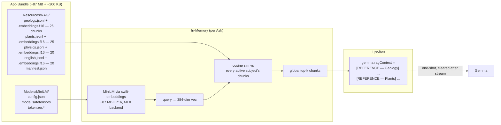
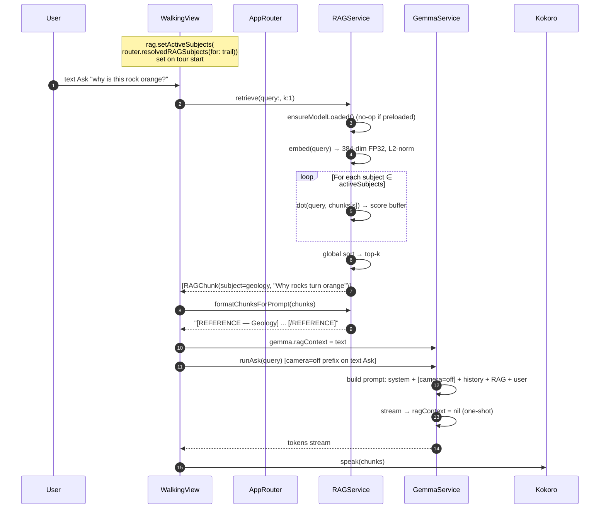

# RAG Runtime — On-Device Retrieval Path

## TLDR

On-device RAG: bundled MiniLM-L6-v2 (~87 MB resident) + 4 pre-embedded subject corpora (geology/plants/physics/english, ~200 KB / 91 chunks total). Multi-subject active set per trail with DebugView override; top-k chunks injected one-shot into Gemma's user prompt and cleared after stream. Stays loaded across Gemma load/unload cycles without ever competing with the LLM.

Semantic retrieval against four pre-embedded subject corpora,
multi-subject active set per trail with runtime override, top-k chunks
injected into Gemma's user prompt one-shot.

Companion to [`06-scenephase-metal-background.md`](06-scenephase-metal-background.md)
(the preload + Kokoro scenePhase fixes that made the path
backgrounding-safe), [`02-architecture-ios-app.md`](02-architecture-ios-app.md)
(architecture context), and [`03-memory-management.md`](03-memory-management.md)
(retrieval memory math).

## Design summary

Tiny resident embedder + flat vector search, with two upgrades over
the naive "download MiniLM on first launch" approach:

1. **Embedder is bundled in-app** (~87 MB) instead of pulled from
   HuggingFace at runtime.
2. **Multi-subject active set + per-trail defaults + DebugView
   override** replaces a hardcoded `setActiveSubject(.geology)`.

## Components



| Component | Where | Size | Lifetime |
|---|---|---|---|
| MiniLM (all-MiniLM-L6-v2) | `Resources/Models/MiniLM/` | ~87 MB on disk + RAM | Preloaded at first `.active`, resident until app exit |
| Subject corpora (4 × jsonl + f16 blob) | `Resources/RAG/` | ~200 KB total (91 chunks) | Loaded into `loadedCorpora` on `setActiveSubjects`, evicted on remove |
| Active embeddings (Float32) | RAM | ~40 KB per subject | Held while subject is in `activeSubjects` set |
| `ragContext` field | `GemmaService` | bytes | One-shot — set before stream, cleared after |

The whole RAG stack is ~87 MB resident — rounding error next to
Gemma's 2.5-3 GB. Stays loaded across the Gemma load/unload cycle
without ever competing with the model.

## Code map

| File | Purpose |
|---|---|
| `RAGService.swift` | Embedder load/unload, multi-subject corpora load+eviction, retrieve, `formatChunksForPrompt` grouping by subject |
| `AppRouter.swift` | `ragSubjectsOverride: Set<Subject>?` + `resolvedRAGSubjects(for: trail)` helper |
| `TrailData.swift` | `Trail.defaultRAGSubjects: [String]` per trail (curator picks, raw strings — no `RAGService` import in `TrailData`) |
| `GemmaService.swift` | `ragContext` one-shot field — injected into user prompt alongside `stopContextBlock`, cleared after stream; emits `[camera=on/off]` SFT data-prefix gate |
| `ContentView.swift` | Owns `RAGService` as `@StateObject`, fires `rag.preload()` from `.task(id: scenePhase)` once active |
| `Views/WalkingView.swift` | Calls `rag.setActiveSubjects(router.resolvedRAGSubjects(for: trail))` on tour start; per-Ask `rag.retrieve(query:k:1)` → `gemma.ragContext`; VLM Asks skip RAG (KV budget) |
| `Views/DebugView.swift` | RAG context section — 4 toggles (one per subject) reading the effective set; writing copies it into `router.ragSubjectsOverride`; reset-to-default button |
| `rag-poc/` | 91 hand-authored chunks (geology 26 / plants 25 / physics 20 / english 20) + Python embedding pipeline (`scripts/embed-rag-corpus.py`) |
| `scripts/fetch-models.sh` | Pulls MiniLM from HF for fresh clones |
| `scripts/embed-rag-corpus.py` | sentence-transformers → float16 embeddings aligned by line index, updates `manifest.json` |
| `project.yml` | `swift-embeddings 0.0.16..0.1.0` (resolved 0.0.26); blue-folder ref for `Resources/RAG/` |

## Multi-subject API

```swift
// RAGService.swift
var activeSubjects: Set<Subject> = []
var loadedCorpora: [Subject: (chunks: [RAGChunk], embeddings: [Float])] = [:]

func setActiveSubjects(_ desired: Set<Subject>) {
    // Diff: load newly-added, evict removed (keeps memory bounded)
    for s in desired.subtracting(activeSubjects) { load(s) }
    for s in activeSubjects.subtracting(desired) { evict(s) }
    activeSubjects = desired
}

func retrieve(query: String, k: Int = 3) -> [RAGChunk] {
    let qVec = embed(query)
    // Scan every active subject's chunk matrix; merge into global top-k
    var hits: [(RAGChunk, Float)] = []
    for s in activeSubjects {
        guard let (chunks, embs) = loadedCorpora[s] else { continue }
        for (i, chunk) in chunks.enumerated() {
            let score = dot(qVec, embs.slice(i))
            hits.append((chunk, score))
        }
    }
    return hits.sorted { $0.1 > $1.1 }.prefix(k).map { $0.0 }
}

func formatChunksForPrompt(_ chunks: [RAGChunk]) -> String {
    // Groups by subject so the LM sees coherent reference blocks
    Dictionary(grouping: chunks, by: \.subject).map { subject, hits in
        "[REFERENCE — \(subject.label)]\n" +
        hits.map { "(\($0.title)) \($0.text)" }.joined(separator: "\n") +
        "\n[/REFERENCE]"
    }.joined(separator: "\n\n")
}
```

### Per-trail defaults

```swift
// TrailData.swift
let defaultRAGSubjects: [String]  // raw strings, no RAGService import
// per trail:
Kildoo     → ["geology", "plants"]
Old Field  → ["plants", "geology"]
Tranquil   → ["plants", "geology"]
```

`WalkingView` converts to `RAGService.Subject` at startup via the
enum's `init(rawValue:)`. Keeping `TrailData` import-free of
`RAGService` keeps the trail catalog data-only — no service-layer
coupling.

### Override surface

```swift
// AppRouter.swift
@Published var ragSubjectsOverride: Set<Subject>? = nil
// nil = use trail default; any value (even empty) takes over.

func resolvedRAGSubjects(for trail: Trail) -> Set<Subject> {
    if let override = ragSubjectsOverride { return override }
    return Set(trail.defaultRAGSubjects.compactMap(Subject.init(rawValue:)))
}
```

### DebugView UI

4 toggles, one per subject. **Reading**: the effective set (override
if active, else trail default). **Writing** any toggle copies the
effective set into `router.ragSubjectsOverride` and applies the change
— auto-promotes "trail default" state to "override active." Reset-to-
default button clears the override.

## Retrieval flow (per Ask)



Numbers on iPhone 17 Pro:
- Embed query: ~5 ms (MLX backend, runs on Apple GPU)
- Cosine search over 2 active subjects × ~25 chunks × 384 dims: ~1 ms
  (~50 dot products, single matmul under the hood)
- Whole retrieve → inject path: well under 50 ms before Gemma even
  starts loading

**VLM Asks skip this path** (`[camera=on]` SFT data-prefix gate goes
in, no RAG). Image already costs ~280 soft tokens; stacking RAG
chunks on top would blow `maxKVSize: 1024`. Text-only Asks only.

## Corpus shape

JSONL, one chunk per line. Schema mirrored in `RAGChunk` struct:

```json
{
  "id": "geo-026",
  "subject": "geology",
  "title": "Why tree trunks bend at the base",
  "text": "...~150 token chunk text used at retrieval...",
  "summary": "one-line gist",
  "tags": ["geomorphology", "phototropism"],
  "region": "western_pa",
  "source": "hand-authored, unvetted"
}
```

**91 chunks total** across 4 subjects (geology 26 / plants 25 /
physics 20 / english 20). Source provenance is **hand-authored and
not vetted** — explicitly called out in `rag-poc/README.md`. Swap for
sourced content before any public ship.

Embeddings file: `<subject>.embeddings.f16` — raw little-endian
Float16, `N × 384` dims, line-index aligned to the jsonl.
L2-normalized at ingest, so cosine sim collapses to a dot product at
retrieval.

## Prompt injection shape

```
[REFERENCE — Geology]
(Why rocks turn orange) Iron-rich sandstones weather to a rust-orange...
(Why tree trunks bend at the base) Soil movement when the tree was young...
[/REFERENCE]

[REFERENCE — Plants]
(Great rhododendron) Found in protected ravine systems across...
[/REFERENCE]
```

Injected by `GemmaService.streamResponse` into the user-turn prompt
alongside:
- `stopContextBlock` (the trail-stop hint)
- `[camera=on]` / `[camera=off]` SFT data-prefix gate (matches Track B
  v4 training-time input distribution)

One-shot — `ragContext` is cleared right after the prefill so the next
turn re-retrieves rather than carrying stale context.

## scenePhase / Metal background safety

The RAG path adds **one new always-resident MLX consumer** (MiniLM)
and **one always-running background task** (the preload). Both need
scenePhase gating:

| Concern | Gate | Commit |
|---|---|---|
| MiniLM preload races with iOS "prewarming" launch (scene still `.inactive`) | `.task(id: scenePhase)` + `guard == .active` | `c067cdd` |
| Kokoro chunk submit hits backgrounded process mid-narration | `.onChange(of: scenePhase)` → `tts.stop()` | `df5788e` |
| Gemma stream submit hits backgrounded process | **unsolved** — needs upstream `mlx-swift-lm` cancellation hook | open |

Full pattern + residual risk in
[`06-scenephase-metal-background.md`](06-scenephase-metal-background.md).

## Logging — `[RAG]` tag

Every step of the path emits a `[RAG]` line. Filter the Xcode console
on that tag to trace one Ask end-to-end:

```
[RAG] preload start
[RAG] loading embedder from /var/containers/.../HikeCompanion.app/Models/MiniLM ...
[RAG] embedder ready (1.34s)
[RAG] preload done
[RAG] setActiveSubjects([.geology, .plants]) — loaded 26 + 25 chunks
[RAG] retrieve subjects=[geology,plants] k=1 q="why is this rock orange?"
[RAG] top: geo-003 "Why rocks turn orange" subject=geology score=0.768
[Gemma] prompt size=614, stopFraming=1, ragContext=1, imageTokens=0, cameraGate=off
```

`GemmaService.streamResponse` adds a `[Gemma]` line with the composed
prompt size and which of `{stopFraming, ragContext, imageTokens,
cameraGate}` were active.

## Known weak spots

| Item | State |
|---|---|
| Subject auto-pick per trail | **Resolved** — per-trail `defaultRAGSubjects` field; DebugView override for testing. |
| Subject picker UI | **Resolved** — DebugView 4-toggle picker + reset button. Debug-only path. |
| Multiple chunks per Ask (k>1) | API supports it (multi-subject retrieve does global top-k); current call sites use k=1 to stay safely inside the 1024 KV budget. |
| Corpus quality | Hand-authored, unvetted (91 chunks). Swap before shipping public. |
| Quantize embedder to INT4 (~23 MB) | Optional; FP16 at ~87 MB is comfortable given Gemma's 2.5 GB anchor. |
| Mid-Gemma-generation backgrounding | RAG itself survives backgrounding cleanly (preload gated, embed too brief to race). Gemma stream cancellation still unsolved. |
| Multi-axis tags (e.g. region + subject) | Not built. Cheap to add as a pre-filter before cosine. |
| Cross-Ask context carry | Intentionally cleared one-shot; debatable for follow-ups within a tour. |

## Cross-references

- Architecture context: [`02-architecture-ios-app.md`](02-architecture-ios-app.md)
- Memory math: [`03-memory-management.md`](03-memory-management.md)
- scenePhase Metal background safety: [`06-scenephase-metal-background.md`](06-scenephase-metal-background.md)
- iOS dev timeline (Phase 6 / Phase 7 RAG work):
  [`09-dev-timeline-ios.md`](09-dev-timeline-ios.md)
- Track B v4 `[camera=on/off]` SFT gate (model-side counterpart):
  [`08-dev-timeline-model.md`](08-dev-timeline-model.md)
