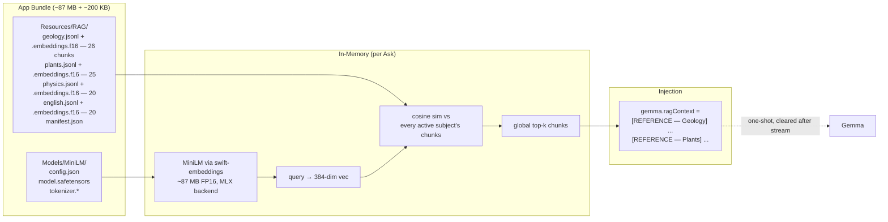
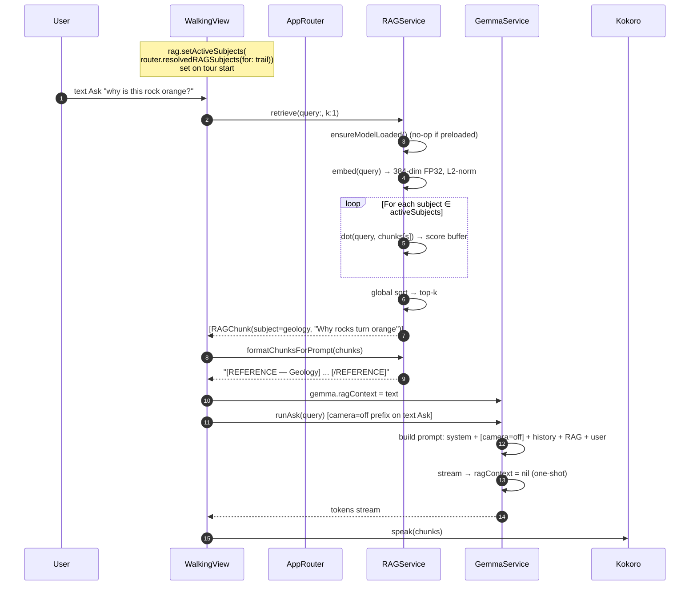

# RAG Runtime — On-Device Retrieval Path

## TL;DR

This is the detail doc behind the writeup's claim that Gemma is the reasoning layer, not the only source of trail truth. Trail facts stay in the downloaded trail package, where they can be curated, updated, and scoped to a specific hike.

The factual content backing the three demonstration trails is **crawled from authoritative public sources and then verified twice — once by a human reviewer, once by GPT-5** — before any chunk reaches the on-device corpus. The fetching pipeline is built with both factuality checks and scalability in mind, so new trails can be added without redoing the retrieval architecture (see [Corpus provenance & the fetching pipeline](#corpus-provenance--the-fetching-pipeline)).

At runtime, Trailogy uses a bundled MiniLM embedder and local vector search to retrieve from the trail's active subject areas, such as geology, ecology, plants, or local history. The top chunks are inserted into the Gemma prompt for that one answer and cleared after generation.

The embedder stays resident because it is small next to Gemma, while the retrieved context remains one-shot so each answer is grounded without turning the model into a trail-fact database.

## Design summary

Tiny resident embedder + flat vector search, with two upgrades over the naive “download MiniLM on first launch” approach:

1. Bundled on-device embedder
The embedder is packaged with the app, about 87 MB, instead of being pulled from Hugging Face at runtime. This keeps the experience offline-ready and avoids first-launch dependency issues.
2. Trail-specific subject activation
Instead of hardcoding retrieval to a single subject like setActiveSubject(.geology), each trail defines its own active subject areas. For example, one trail may activate geology and forest ecology, while another may activate wetlands, plants, and local history. DebugView can override the active set at runtime, which made testing and tuning easier.
## Components



| Component | Where | Size | Lifetime |
|---|---|---|---|
| MiniLM (all-MiniLM-L6-v2) | `Resources/Models/MiniLM/` | ~87 MB on disk + RAM | Preloaded at first `.active`, resident until app exit |
| Subject corpora (4 × jsonl + f16 blob) | `Resources/RAG/` | ~200 KB total (91 chunks) | Loaded into `loadedCorpora` on `setActiveSubjects`, evicted on remove |
| Active embeddings (Float32) | RAM | ~40 KB per subject | Held while subject is in `activeSubjects` set |
| `ragContext` field | `GemmaService` | bytes | One-shot — set before stream, cleared after |

The whole RAG stack is ~87 MB resident — rounding error next to
Gemma's 2.5-3 GB. Stays loaded across the Gemma load/unload cycle
without ever competing with the model.

## Code map

| File | Purpose |
|---|---|
| `RAGService.swift` | Embedder load/unload, multi-subject corpora load+eviction, retrieve, `formatChunksForPrompt` grouping by subject |
| `AppRouter.swift` | `ragSubjectsOverride: Set<Subject>?` + `resolvedRAGSubjects(for: trail)` helper |
| `TrailData.swift` | `Trail.defaultRAGSubjects: [String]` per trail (curator picks, raw strings — no `RAGService` import in `TrailData`) |
| `GemmaService.swift` | `ragContext` one-shot field — injected into user prompt alongside `stopContextBlock`, cleared after stream; emits `[camera=on/off]` SFT data-prefix gate |
| `ContentView.swift` | Owns `RAGService` as `@StateObject`, fires `rag.preload()` from `.task(id: scenePhase)` once active |
| `Views/WalkingView.swift` | Calls `rag.setActiveSubjects(router.resolvedRAGSubjects(for: trail))` on tour start; per-Ask `rag.retrieve(query:k:1)` → `gemma.ragContext`; VLM Asks skip RAG (KV budget) |
| `Views/DebugView.swift` | RAG context section — 4 toggles (one per subject) reading the effective set; writing copies it into `router.ragSubjectsOverride`; reset-to-default button |
| `rag-poc/` | 91 curated chunks (geology 26 / plants 25 / physics 20 / english 20) sourced via the crawl + dual-verification pipeline; embedded by `scripts/embed-rag-corpus.py` |
| `scripts/fetch-models.sh` | Pulls MiniLM from HF for fresh clones |
| `scripts/embed-rag-corpus.py` | sentence-transformers → float16 embeddings aligned by line index, updates `manifest.json` |
| `project.yml` | `swift-embeddings 0.0.16..0.1.0` (resolved 0.0.26); blue-folder ref for `Resources/RAG/` |

## Multi-subject API

```swift
// RAGService.swift
var activeSubjects: Set<Subject> = []
var loadedCorpora: [Subject: (chunks: [RAGChunk], embeddings: [Float])] = [:]

func setActiveSubjects(_ desired: Set<Subject>) {
    // Diff: load newly-added, evict removed (keeps memory bounded)
    for s in desired.subtracting(activeSubjects) { load(s) }
    for s in activeSubjects.subtracting(desired) { evict(s) }
    activeSubjects = desired
}

func retrieve(query: String, k: Int = 3) -> [RAGChunk] {
    let qVec = embed(query)
    // Scan every active subject's chunk matrix; merge into global top-k
    var hits: [(RAGChunk, Float)] = []
    for s in activeSubjects {
        guard let (chunks, embs) = loadedCorpora[s] else { continue }
        for (i, chunk) in chunks.enumerated() {
            let score = dot(qVec, embs.slice(i))
            hits.append((chunk, score))
        }
    }
    return hits.sorted { $0.1 > $1.1 }.prefix(k).map { $0.0 }
}

func formatChunksForPrompt(_ chunks: [RAGChunk]) -> String {
    // Groups by subject so the LM sees coherent reference blocks
    Dictionary(grouping: chunks, by: \.subject).map { subject, hits in
        "[REFERENCE — \(subject.label)]\n" +
        hits.map { "(\($0.title)) \($0.text)" }.joined(separator: "\n") +
        "\n[/REFERENCE]"
    }.joined(separator: "\n\n")
}
```

### Per-trail defaults

```swift
// TrailData.swift
let defaultRAGSubjects: [String]  // raw strings, no RAGService import
// per trail:
Kildoo     → ["geology", "plants"]
Old Field  → ["plants", "geology"]
Tranquil   → ["plants", "geology"]
```

`WalkingView` converts to `RAGService.Subject` at startup via the
enum's `init(rawValue:)`. Keeping `TrailData` import-free of
`RAGService` keeps the trail catalog data-only — no service-layer
coupling.

### Override surface

```swift
// AppRouter.swift
@Published var ragSubjectsOverride: Set<Subject>? = nil
// nil = use trail default; any value (even empty) takes over.

func resolvedRAGSubjects(for trail: Trail) -> Set<Subject> {
    if let override = ragSubjectsOverride { return override }
    return Set(trail.defaultRAGSubjects.compactMap(Subject.init(rawValue:)))
}
```

### DebugView UI

4 toggles, one per subject. **Reading**: the effective set (override
if active, else trail default). **Writing** any toggle copies the
effective set into `router.ragSubjectsOverride` and applies the change
— auto-promotes "trail default" state to "override active." Reset-to-
default button clears the override.

## Retrieval flow (per Ask)



Numbers on iPhone 17 Pro:
- Embed query: ~5 ms (MLX backend, runs on Apple GPU)
- Cosine search over 2 active subjects × ~25 chunks × 384 dims: ~1 ms
  (~50 dot products, single matmul under the hood)
- Whole retrieve → inject path: well under 50 ms before Gemma even
  starts loading

**VLM Asks skip this path** (`[camera=on]` SFT data-prefix gate goes
in, no RAG). Image already costs ~280 soft tokens; stacking RAG
chunks on top would blow `maxKVSize: 1024`. Text-only Asks only.

## Corpus shape

JSONL, one chunk per line. Schema mirrored in `RAGChunk` struct:

```json
{
  "id": "geo-026",
  "subject": "geology",
  "title": "Why tree trunks bend at the base",
  "text": "...~150 token chunk text used at retrieval...",
  "summary": "one-line gist",
  "tags": ["geomorphology", "phototropism"],
  "region": "western_pa",
  "source": "crawled from authoritative source; verified by human + GPT-5"
}
```

**91 chunks total** across 4 subjects (geology 26 / plants 25 /
physics 20 / english 20). Every chunk that backs the three
demonstration trails was crawled from authoritative public sources and
then double-checked for factuality — see
[Corpus provenance & the fetching pipeline](#corpus-provenance--the-fetching-pipeline).

Embeddings file: `<subject>.embeddings.f16` — raw little-endian
Float16, `N × 384` dims, line-index aligned to the jsonl.
L2-normalized at ingest, so cosine sim collapses to a dot product at
retrieval.

## Corpus provenance & the fetching pipeline

The factual content shipped for the three demonstration trails
(Kildoo, Old Field, Tranquil) is **not hand-written prose**. Every
chunk is the output of a fetch-and-verify pipeline whose two design
goals are factuality and scalability:

- **Crawled, not authored.** Source material is pulled from
  authoritative public references — USGS for geology, USDA PLANTS and
  Wikipedia species pages for plants, OpenStax for physics, Project
  Gutenberg / Standard Ebooks for nature-writing English. The pipeline
  keeps the source URL on each chunk so retrieval and audit trails can
  both follow back to ground truth.
- **Dual verification.** Each chunk is reviewed twice before it lands
  in the on-device corpus:
  1. A **human reviewer** checks domain plausibility and trail
     relevance (e.g. "this Mississippian-age sandstone description
     actually fits the Kildoo gorge").
  2. **GPT-5** is used as a second pass to flag factual drift,
     ambiguous claims, and citations that don't match the chunk text.
  Only chunks that survive both passes are embedded and shipped.
- **Built to scale.** The pipeline is parameterized over (trail,
  subject) so adding a new demonstration trail does not mean
  re-running the retrieval architecture — only the corpus expands.
  Embedding, indexing, and bundling are reproducible from the jsonl
  alone, so the on-device runtime never changes when the corpus does.

This is the reason the runtime side of RAG can stay so small (~87 MB
embedder + a few hundred KB of chunks per trail): the heavy quality
work happens off-device, ahead of time. The on-device path only has
to do retrieval, not vetting.

## Prompt injection shape

```
[REFERENCE — Geology]
(Why rocks turn orange) Iron-rich sandstones weather to a rust-orange...
(Why tree trunks bend at the base) Soil movement when the tree was young...
[/REFERENCE]

[REFERENCE — Plants]
(Great rhododendron) Found in protected ravine systems across...
[/REFERENCE]
```

Injected by `GemmaService.streamResponse` into the user-turn prompt
alongside:
- `stopContextBlock` (the trail-stop hint)
- `[camera=on]` / `[camera=off]` SFT data-prefix gate (matches Track B
  v4 training-time input distribution)

One-shot — `ragContext` is cleared right after the prefill so the next
turn re-retrieves rather than carrying stale context.

## scenePhase / Metal background safety

The RAG path adds **one new always-resident MLX consumer** (MiniLM)
and **one always-running background task** (the preload). Both need
scenePhase gating:

| Concern | Gate | Commit |
|---|---|---|
| MiniLM preload races with iOS "prewarming" launch (scene still `.inactive`) | `.task(id: scenePhase)` + `guard == .active` | `c067cdd` |
| Kokoro chunk submit hits backgrounded process mid-narration | `.onChange(of: scenePhase)` → `tts.stop()` | `df5788e` |
| Gemma stream submit hits backgrounded process | **unsolved** — needs upstream `mlx-swift-lm` cancellation hook | open |

Full pattern + residual risk in
[`06-scenephase-metal-background.md`](06-scenephase-metal-background.md).

## Logging — `[RAG]` tag

Every step of the path emits a `[RAG]` line. Filter the Xcode console
on that tag to trace one Ask end-to-end:

```
[RAG] preload start
[RAG] loading embedder from /var/containers/.../HikeCompanion.app/Models/MiniLM ...
[RAG] embedder ready (1.34s)
[RAG] preload done
[RAG] setActiveSubjects([.geology, .plants]) — loaded 26 + 25 chunks
[RAG] retrieve subjects=[geology,plants] k=1 q="why is this rock orange?"
[RAG] top: geo-003 "Why rocks turn orange" subject=geology score=0.768
[Gemma] prompt size=614, stopFraming=1, ragContext=1, imageTokens=0, cameraGate=off
```

`GemmaService.streamResponse` adds a `[Gemma]` line with the composed
prompt size and which of `{stopFraming, ragContext, imageTokens,
cameraGate}` were active.

## Known weak spots

| Item | State |
|---|---|
| Subject auto-pick per trail | **Resolved** — per-trail `defaultRAGSubjects` field; DebugView override for testing. |
| Subject picker UI | **Resolved** — DebugView 4-toggle picker + reset button. Debug-only path. |
| Multiple chunks per Ask (k>1) | API supports it (multi-subject retrieve does global top-k); current call sites use k=1 to stay safely inside the 1024 KV budget. |
| Corpus quality (3 demo trails) | **Resolved** — crawled from authoritative public sources and dual-verified by a human reviewer + GPT-5 before embedding. See [Corpus provenance & the fetching pipeline](#corpus-provenance--the-fetching-pipeline). |
| Quantize embedder to INT4 (~23 MB) | Optional; FP16 at ~87 MB is comfortable given Gemma's 2.5 GB anchor. |
| Mid-Gemma-generation backgrounding | RAG itself survives backgrounding cleanly (preload gated, embed too brief to race). Gemma stream cancellation still unsolved. |
| Multi-axis tags (e.g. region + subject) | Not built. Cheap to add as a pre-filter before cosine. |
| Cross-Ask context carry | Intentionally cleared one-shot; debatable for follow-ups within a tour. |

## Cross-references

- Architecture context: [`02-architecture-ios-app.md`](02-architecture-ios-app.md)
- Memory math: [`03-memory-management.md`](03-memory-management.md)
- scenePhase Metal background safety: [`06-scenephase-metal-background.md`](06-scenephase-metal-background.md)
- iOS dev timeline (Phase 6 / Phase 7 RAG work):
  [`09-dev-timeline-ios.md`](09-dev-timeline-ios.md)
