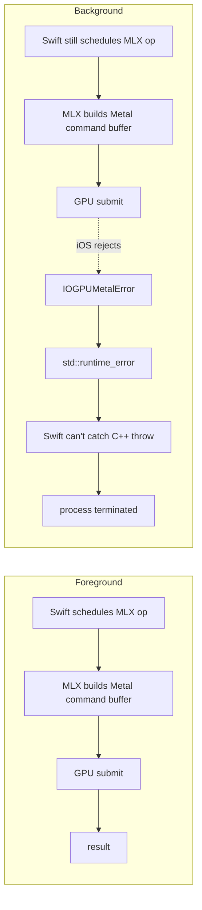

# scenePhase × Metal — Background-Execution Crash Fix

## TLDR

iOS forbids Metal command-buffer submission from backgrounded apps; MLX's C++ runtime raises `std::runtime_error`, which Swift cannot catch, so any GPU submit after foreground->background terminates the process. Two fixes: gate MiniLM preload with `.task(id: scenePhase)` against `.active`, and abort Kokoro's chunked synth loop on phase change. Gemma streaming remains a residual risk.

Two crashes hit during Phase 6 PoC testing, both rooted in the same
iOS rule: **Metal command buffers cannot be submitted from a
backgrounded app.** MLX's C++ runtime guards this with
`std::runtime_error`, which Swift **cannot catch** — so any GPU
submission during/after the foreground → background transition
terminates the process.

Both fixes use SwiftUI `scenePhase` as the trigger, but in two
different ways that are worth distinguishing.

## The crash signature

```
IOGPUMetalError: Insufficient Permission (to submit GPU work from background)
... kIOGPUCommandBufferCallbackErrorBackgroundExecutionNotPermitted
std::runtime_error: [METAL] Command buffer execution failed: ...
```

The C++ throw escapes through MLX into Swift, where there is no
`do/catch` that can stop it. Process is killed.



Three concrete code paths exposed this:

1. **MiniLM preload via `.task`** — fires at view-appearance time,
   can race with iOS "prewarming" launch where the app exists but the
   scene is still `.inactive`.
2. **Kokoro chunked synth** — submits one Metal buffer per chunk; if
   the user backgrounds mid-narration, the next-chunk submit hits a
   backgrounded process.
3. **Gemma stream generation** — same mechanism, but no clean fix
   lives in this commit. Still a residual risk.

## Fix 1 — Gate preload with `.task(id: scenePhase)` (`c067cdd`)

**Where**: `ContentView.swift`.

**What was wrong**:

```swift
// Old shape: fires at view appear, ignores scene state
.task {
    try? await rag.preload()
}
```

`.task` runs the body once when the view appears. On a prewarmed
launch, the view can appear while `scenePhase == .inactive`. MiniLM
preload kicks off → Metal submit → iOS rejects → crash.

**Fix**:

```swift
// New shape: runs at appear AND on every scenePhase change.
// Body gates on .active, so preload only fires when Metal will accept.
.task(id: scenePhase) {
    guard scenePhase == .active else { return }
    guard !didPreloadRAG else { return }     // one-shot latch
    didPreloadRAG = true
    do {
        try await rag.preload()
    } catch {
        print("[RAG] preload failed: \(error.localizedDescription)")
    }
}
```

Why `.task(id:)` and not `.onChange(of: scenePhase)`:

- `.onChange` only fires on **transitions**. If the app launches
  straight to `.active` (common path), there is no transition —
  `.onChange` never runs and preload never fires.
- `.task(id:)` runs the body on initial appearance **for the current
  id value too**, and then again on every id change. Body fires
  whether the app launches straight to `.active` or transitions
  through `.inactive`.

The `didPreloadRAG` latch keeps it to exactly one load over the
lifetime of the app. MiniLM (~87 MB resident) stays in RAM across
background cycles — too small to bother unloading.

## Fix 2 — `tts.stop()` on scenePhase leave-`.active` (`df5788e`)

**Where**: `ContentView.swift`.

**What was wrong**: Kokoro's chunked streaming synth submits a Metal
command buffer per chunk. Mid-narration, the loop is on its 4th of 8
chunks when the user swipes up. The 5th chunk's GPU submit lands in
a backgrounded process → crash.

**Fix**:

```swift
.onChange(of: scenePhase) { _, newPhase in
    if newPhase != .active {
        print("[App] scenePhase → \(newPhase), halting Kokoro to avoid background GPU crash")
        tts.stop()
    }
}
```

`tts.stop()` cancels the synth loop, halts the `AVAudioPlayerNode`,
and flips `isRunning = false` synchronously on main. The
currently-executing GPU chunk (if any) typically completes before iOS
fully backgrounds — the race window is narrow (~100-500 ms per chunk)
but not zero.

Why `.onChange` here, not `.task(id:)`: we want to react to
**transitions out of `.active`**, not to the steady-state value.
`.task(id:)` would re-run the body when re-entering `.active` too,
which is the wrong shape for "halt in-flight work."

## Two patterns side-by-side

| | Fix 1 — Preload gating | Fix 2 — Halt synth on leave |
|---|---|---|
| Trigger | `.task(id: scenePhase)` + `guard == .active` | `.onChange(of: scenePhase)` + `if != .active` |
| When fires | View appear + every scenePhase change | Only on transitions |
| Reason | Need to fire on initial-appear-while-active (launch path) | Only the leave-`.active` event matters |
| Latch | `didPreloadRAG = true` to one-shot | None — calling `tts.stop()` is idempotent and cheap |
| What it protects | The first MLX op of the app's life | Every in-flight Kokoro chunk after backgrounding |

## Residual risk — what these fixes do NOT cover

1. **A Kokoro chunk whose GPU buffer was already submitted** before
   `scenePhase` fires `.inactive` can still abort and crash. Window
   is ~100-500 ms per chunk. Not zero.
2. **Mid-Gemma-generation backgrounding** is the bigger unfixed case.
   `mlx-swift-lm`'s `streamGenerate` has **no stream-level
   cancellation hook**. Cleaning that up requires either:
   - Upstream a cancellation API into `mlx-swift-lm`, or
   - Wrap the stream with our own cancellation token that breaks out
     of the iterator (skipping further GPU submits, but the
     current-buffer race remains).
3. **MiniLM embed (~50 ms)** is in principle exposed to the same
   window but practically rare — by the time the user backgrounds
   mid-Ask, embed has long since finished and we're in Gemma's
   generation phase (which has the bigger problem above).

For the hackathon scope these residual cases are rare enough to live
with. For shipping, the Gemma stream cancellation is the next thing
to fix.

## Why Swift can't catch this

It's worth being explicit: this isn't a Swift error-handling style
choice. It's a language boundary.

```
Swift code
   ↓ calls
MLX Swift bindings
   ↓ calls
MLX C++ backend
   ↓ throws std::runtime_error (Metal submit rejected)
   ✗ Swift's `try/catch` can only catch types conforming to `Error`.
     C++ exceptions are an entirely different unwinding mechanism.
   ✗ The runtime aborts the process.
```

Conclusion: **prevention upstream of the C++ call is the only fix.**
Don't submit work that iOS will reject. Hence the scenePhase gating.

## Logging

`[App] scenePhase → <phase>, halting Kokoro...` from the `.onChange`
handler.

`[RAG] preload start / done / failed` from the gated `.task(id:)`.

Both visible in the Xcode console — useful for confirming the gate
actually fires when expected, especially on the prewarmed launch path.

## Cross-references

- `c067cdd` `fix(rag): gate MiniLM preload on scenePhase == .active`
- `df5788e` `fix(rag): halt Kokoro on scenePhase leave-active to survive backgrounding`
- RAG runtime overview: [`05-rag-runtime.md`](05-rag-runtime.md)
- iOS architecture: [`02-architecture-ios-app.md`](02-architecture-ios-app.md)
- Memory discipline (RAG always-resident across background cycles):
  [`03-memory-management.md`](03-memory-management.md)
- "MLX memory is not like CPU memory" lesson —
  [`09-dev-timeline-ios.md`](09-dev-timeline-ios.md) Lessons Learned.
