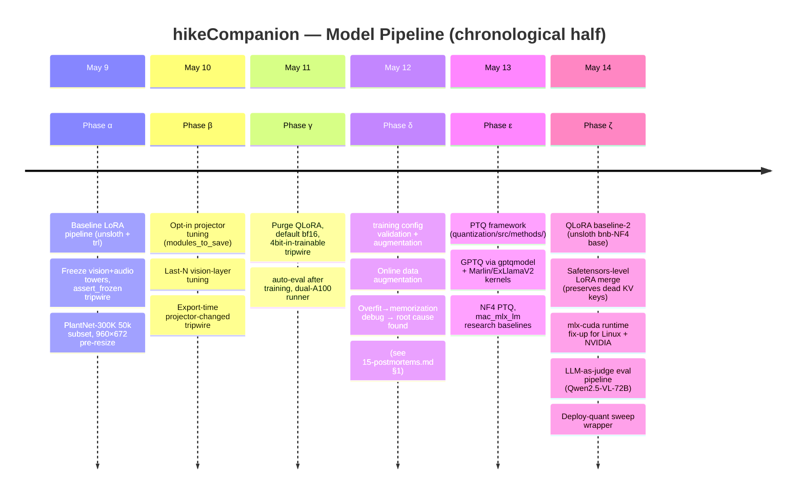
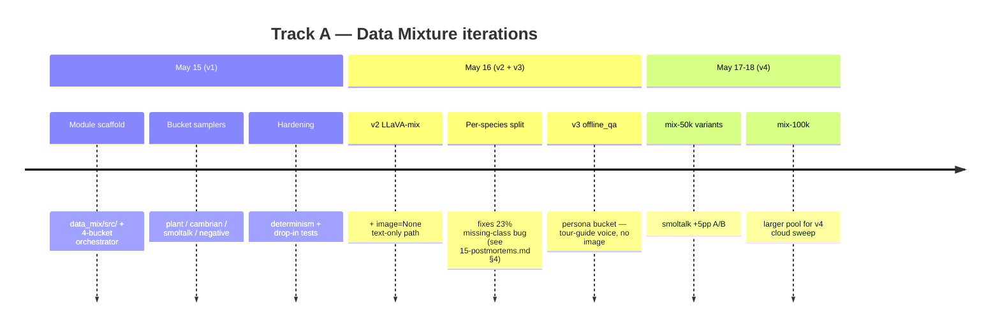
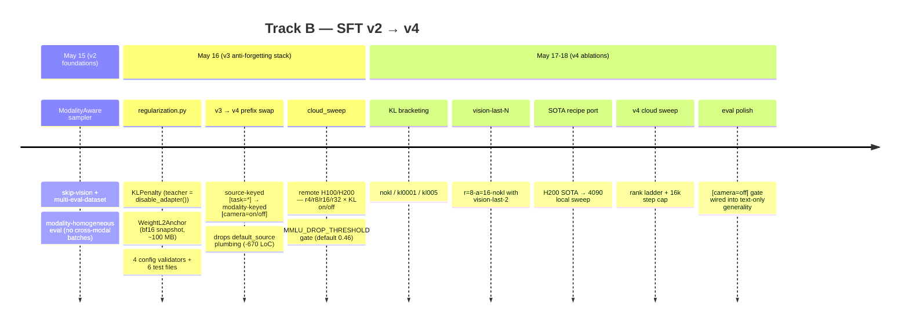
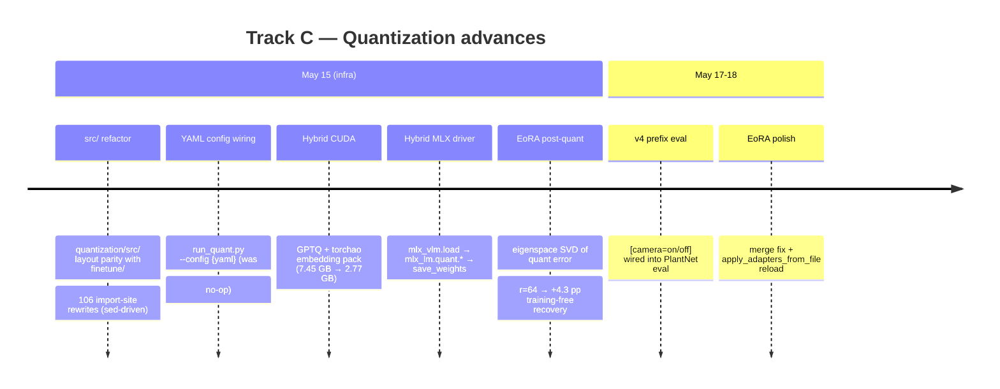

# Model-Side Development Timeline (SFT · Data Mixture · Quantization)

## TL;DR

- The model work ran as a short sprint across data mixture, supervised fine-tuning, and quantization tracks.
- Data mixture evolved from a plant-focused set into broader multimodal and offline-answering mixtures.
- Fine-tuning added sampler, prefix, and anti-forgetting changes to improve plant knowledge without collapsing general behavior.
- Quantization moved from research baselines to deployable MLX artifacts and post-quantization recovery experiments.
- Numbers from different phases are not directly comparable unless they are rerun under the same evaluator settings.

## Overview

- **Duration**: 10 days (May 9-18, 2026).
- **Three parallel tracks** (interleaved May 9-14, branched out May 15+):
  - **A · Data Mixture** — `data_mix/` module: 4-bucket
    (plant/cambrian/smoltalk/refuse) → v2 LLaVA → v3 offline_qa
    persona → v4 50k variants
  - **B · SFT** — v2 ModalityAware sampler → v3 anti-forgetting stack
    (KL + L2 + camera-state prefix) → v4 cloud + local sweeps (LoRA
    rank, KL bracket, vision-last-N ablation)
  - **C · Quantization** — `src/` refactor + YAML wiring → hybrid CUDA
    (GPTQ + torchao) → hybrid MLX (`mlx_vlm.load → mlx_lm.quant.*`) →
    EoRA post-quant adapter (training-free quality recovery)
- **Hardware**: 4090 desktop (24 GB), 4090 laptop (16 GB), 2× A100
  (40 GB), H100/H200 cloud, Apple Silicon (M-series).
- **Deliverable target**: Gemma 4 E2B at ≤ 4 GB on disk, loadable by
  `mlx-swift-lm` in `.vlm` mode, ≥ 60 % PlantNet match while
  retaining ≥ 46 % MMLU (no catastrophic forgetting).

## Phase progression (May 9-14, chronological)

### Phase α key result — baseline LoRA pipeline

- **What shipped**: end-to-end LoRA SFT of Gemma 4 E2B on
  PlantNet-300K with vision + audio towers frozen, producing a
  merge-ready adapter that survives the MLX export path.
- **Three tripwires** that defended against silent loss of the
  vision tower across train → export → deploy:
  1. `AutoModelForCausalLM` at merge time silently drops
     `vision_tower` / `embed_vision`. → enforce
     `AutoModelForImageTextToText`.
  2. `mlx_lm.convert` is language-only. → enforce `mlx_vlm.convert`.
  3. `mlx-swift-lm` falls back to 800×800 if `processor_config.json`
     unpatched, producing degenerate pooler output. → patch to
     960×672 at export.

### Phase β — projector + last-N vision opt-in modes

`tune_projector: true` unfreezes the vision-language projector as
full parameters (~1.18 M params); `tune_last_n_vision_layers: N`
adds last-N SigLIP layers via PEFT `modules_to_save`. Both opt-in
(default 0) — every existing LoRA-only config produces bit-identical
behavior.

Tripwire philosophy introduced this phase (and persisting through the
project):

- `assert_frozen` allowlist on frozen-token params.
- `ensure_projector_trainable` / `ensure_vision_layers_trainable`
  belt-and-braces fallback (re-flip `requires_grad=True` with WARNING
  log if PEFT silently drops `modules_to_save`).
- **Save tripwire** — adapter safetensors header must contain every
  tuned tensor.
- **Export tripwire** — byte-equality snapshot before / after adapter
  load must differ for every tuned module. Identical = PEFT silently
  failed.

### Phase γ — bf16 default + train hardening

Locked dtype and optimizer policy; auto-eval after every run; 2× A100
parallel runner. Critical fix (`be4511c`): purged QLoRA from defaults,
added `_assert_no_4bit_in_trainable_full_param_modules` tripwire.
`bnb.Params4bit` in `modules_to_save` silently broke projector
tuning.

### Phase δ — Hyperparam tuning + augmentation + the overfit debug marathon

The defining day of the sprint. See [`15-postmortems.md`](15-postmortems.md)
§1 for the full story; short version: **`transformers 5.5 → 5.8`
restructured Gemma 4 KV-shared layers**, PEFT silently dropped 80
LoRA tensors on reload, every old adapter reverted to base behavior
post-save. Fixed by upgrading and retraining. In-pipeline tripwires
landed (`4fab396`) to catch the bug class.

Other same-day fixes:
- `warmup_ratio`, `group_by_length`, `tf32`, `save_total_limit`
  modernized for `transformers 5.x`.
- 8 eval/train parity bugs (chat template, model class, max_new_tokens
  threading, etc.).
- Online data augmentation (opt-in, train-only).

### Phase ε — PTQ framework

Stood up the post-training quantization pipeline. Two families:
HF/CUDA (`gptqmodel`, `bnb-NF4`) for accuracy-credible PTQ; Apple
`mlx_lm.quant.*` (`mac_mlx_lm` series) for the research track.

**Phase ε result table** (HF/CUDA winner, n=2870):

| Variant | Size | PlantNet match | ROUGE-L | WikiText PPL ratio |
|---|---|---|---|---|
| `bf16_reference` | 9.51 GB | **70.6 %** | 0.711 | 1.00× |
| `gptq_w4g128_da0` | 7.0 GB | 68.4 % | 0.694 | 1.10× |
| **`gptq_w4g128_da1`** ⚠️ | **6.97 GB** | **68.8 %** | 0.699 | **1.02×** |
| `bnb_nf4` (skip vt+ev) | 6.31 GB | 0.1 % ← catastrophic | 0.238 | 1.42× |

⚠️ The `da=1` row is flagged because `f94697a` later revealed YAML
config wiring was inactive — both runs likely used `desc_act=False`.
Re-run queued.

The catastrophic bnb-NF4 row was the first run without `skip_modules`
— vision-tower NF4 collapses species_match to noise. Fix landed
mid-phase; **`skip_modules = [vision_tower, embed_vision]` is now
the mandatory default**.

Persistent ceiling problem: even the GPTQ winner is at 6.97 GB on
disk because HF backends leave vision + audio towers bf16. Crossing
the ~4 GB iOS line requires the MLX side (Phase ζ → Track C).

### Phase ζ — QLoRA + MLX deploy quant + judge

Closed the deploy loop. Direct training on a 4-bit base (baseline-2,
QLoRA on `unsloth/gemma-4-E2B-it-unsloth-bnb-4bit`) tested cheaply,
~3× faster wall time, statistically indistinguishable from
baseline-1's bf16+PTQ recipe. **SFT itself is sound.**

**The 45-pp deploy collapse is opened entirely by `mlx_vlm.convert`'s
data-free affine quantizer.** A 5-variant deploy-quant sweep on the
baseline-2 merged checkpoint:

| # | Variant | Size | species_match (n=200) |
|---|---|---|---|
| 0 | g64 affine (baseline) | 3.37 GB | 22.5 % |
| 1 | g64 + skip `embed_vision` | 3.40 GB | 28.5 % |
| 2 | g32 affine | 3.70 GB | 31.0 % |
| 2b | g32 + skip `embed_vision` | 3.70 GB | **35.5 %** |
| 3 | `mixed_4_8` | 4.80 GB | 35.5 % (over ceiling) |
| 4 | `mixed_3_4` | 3.20 GB | 7.0 % |

Best under-4-GB variant is **#2b at 35.5 %** — still 30 pp below
bf16-merged. The plateau is the **data-free quantizer**, not the bit
budget. Closing the gap requires calibration-based PTQ (Route B.2
hybrid) or QAT in late SFT.

Other Phase ζ landings:

- **Safetensors-level LoRA merge** (`4c00bf0`) bypasses
  `transformers`' silent KV-shared key drop — see
  [`14-package-versions-and-known-bugs.md`](14-package-versions-and-known-bugs.md) §3.
- **mlx-cuda Linux runtime fix** (`54c1b9d`) — staged CUDA 12.9 pip
  wheels via `_mlx_env.sh`; `mlx_vlm` eval now runs on Linux + NVIDIA
  in ~1 s/sample.
- **LLM-as-judge pipeline** (`0c04ccd`) — Qwen2.5-VL-72B with
  structured JSON scoring on accuracy / richness / hallucination.
  Lets us numerically separate variants whose `species_match` is in
  the noise floor.

## Per-track timelines (May 15-18)

From May 15 the work splits into three parallel tracks. A bridge
**Phase η** (May 15) carries the infra commits all three depend on:
`src/` refactor, YAML config wiring, `scripts/` reorg, ModalityAware
hardening, EoRA scaffold.

### Track A — Data Mixture (May 15-18)

**Goal**: replace single-source PlantNet diet with a 4-bucket curated
mix that combats catastrophic forgetting *at the training-data level*
(complementary to Track B's regularization-level defense).

**Key insight (per-species stratified split)**: pre-fix
`val.jsonl` was generated by `samples[:val_count]` after random
shuffle of the 50k stratified train pool. With PlantNet's long-tailed
distribution, the random tail systematically **dropped 23 % of
species (177/782)** from val while still including them in train.
Post-fix uses `class_stratified_split`. See
[`15-postmortems.md`](15-postmortems.md) §4 for the postmortem.

### Track B — SFT v2 / v3 / v4 (May 15-18)

**Goal**: turn the bf16 LoRA baseline into a production-ready
training recipe that (a) accepts multi-bucket data without
modality-collation breakage, (b) preserves general capability under
heavy plant SFT, and (c) is explorable cheaply on a 4090 + scalably
on H100/H200 cloud.

**Key insight (v3 anti-forgetting stack)**: three regularizers attack
catastrophic forgetting from three different angles, each with
near-zero memory cost:

1. **KL penalty** — teacher is the same model under PEFT's
   `disable_adapter()` context manager → no second model load, zero
   extra GPU memory.
2. **L2 weight anchor** to param-at-init snapshot. For LoRA delta
   params (initialized small/zero) this is standard weight decay; for
   `modules_to_save` full-rank params it's genuine EWC-style "stay
   close to pretrained" anchoring.
3. **Conditional-FT prefix** — `[task=*]` (v3) → `[camera=on/off]`
   (v4) prepended to first user turn. Model learns to gate fine-tune
   behavior on the marker → prompts without it stay closer to
   pretrained base.

**Key insight (camera-state vs source-keyed prefix)**: v3 keyed
prefixes on `record.source` (a topic classifier:
`plantnet`/`refuse`/`llava`); v4 keys on `record["image"]`
truthiness — a pure modality-state flag. An image record gets
`[camera=on]` regardless of whether the user is asking about the
plant in the photo or about the weather. Simpler dispatcher, **−670
LoC** of `default_source` plumbing, model behaves the same. Modality
is a property of the **request**; topic is a property of the
**content** — dispatching on the former is far cheaper.

**Key insight (cloud sweep design)**: the ~4 GB MMLU trade-off can't
be characterized from a single run. Cloud sweep runs 5 configs × 1000
steps on a single H100/H200, ≤ 4 h wall total, each followed by a
170-sample deterministic generality eval. Glob-based queue — drop a
new YAML and re-launch.

### Track C — Quantization (May 15-18)

**Goal**: close the 45-pp deploy gap from Phase ζ. Two routes
pursued in parallel:

- **Route B.1** (CUDA-side calibration-grade PTQ via GPTQ + torchao)
  lands a sub-4 GB **reference artifact**, even if not directly
  MLX-loadable.
- **Route B.2** (Mac-native hybrid flow) is the actual deploy path:
  `mlx_vlm.load` → `mlx_lm.quant.*` on language-only sub-module →
  `mlx_vlm.utils.save_weights`. No splice step. Plus **EoRA** as
  training-free post-quant quality recovery.

**Key insight (GPTQ + torchao hybrid)**: GPTQ alone leaves the
embedding table unquantized (7.45 GB). Post-processing: strip
`audio_tower` + `embed_audio` (-0.61 GB; iOS doesn't use audio), then
quantize `embed_tokens` via torchao `IntxWeightOnlyConfig` (int4
g128). Catch: **torchao stores int4 packed inside int8 on CUDA** — we
pack ourselves at save time to recover the 2× storage saving.
Result: **2.77 GB, under the iOS ceiling, CUDA-side quality reference**
for cross-validating MLX deploy.

**Key insight (EoRA)**: arXiv:2410.21271 computes LoRA-shaped
adapters from eigenspace-weighted SVD of quantization error, applied
at inference as a QLoRA-style low-rank correction. **No gradient
descent**, ~28 min calibration on M5 Pro (128×512 WikiText-2). r=64
closes **+4.3 pp** on M2 g64-affine (83.7 % → 88.0 %, vs bf16 ceiling
88.3 %), getting within noise of the unquantized result. Output
safetensors with `.lora_a/.lora_b` keys is directly compatible with
`mlx-swift-lm` `QLoRALinear` for iOS deploy — **the recovery path
ships through the same QLoRA loader the iOS app already uses**.

**Key insight (hybrid MLX driver)**: the earlier `mac_mlx_lm` series
required a splice step because Apple's `mlx_lm.quant.*` only produces
a language-only tree. The hybrid driver inverts the order:
`mlx_vlm.load` first (full multimodal tree with the right classes),
then `mlx_lm.quant.*` on `model.language_model` in-place, then
`mlx_vlm.utils.save_weights`. Output is directly `mlx_vlm.load`-able
with no splice step.

**Key insight (YAML config wiring)**: `f94697a` revealed that
`quantization/configs/*.yaml` were authored but **never loaded** —
`run_quant.py` instantiated `GPTQConfig()` with no kwargs. `desc_act:
true` from YAML had **zero effect** on actual runs for the entire
Phase ε. Silent invalidation. Fixed + added unit test
(`tests/test_run_quant_yaml.py`) that round-trips a non-default YAML
and asserts the constructed config matches. Catches this class of
bug at PR time. See [`15-postmortems.md`](15-postmortems.md) "Common
defenses" for the pattern.

## Eval results — cross-phase summary

⚠️ **Read with caveat** ([`10-eval-setup.md`](10-eval-setup.md)
benchmark drift): n varies, val pool varies, loader varies. Numbers
are not strictly apples-to-apples across rows.

| Path | Variant | Size | PlantNet match | n | Phase / Track |
|---|---|---|---|---|---|
| Baseline | bf16 SFT (LoRA r=256 + projector) | 9.51 GB | **70.6 %** | 2870 | δ |
| Route B.1 (CUDA PTQ) | GPTQ w4g128 da=1 ⚠️ | 6.97 GB | **68.8 %** | 2870 | ε (re-run pending — YAML wiring fix) |
| Route B.1 | bnb-NF4 (skip vt+ev) | 6.31 GB | 69.3 % | 300 | ε |
| Route A (QLoRA SFT) | bf16-merged | 9.57 GB | 67.5 % | 200 | ζ |
| Route A | bnb-NF4 (skip vt+ev) | 6.52 GB | 69.5 % | 200 | ζ |
| Deploy candidate | MLX-INT4 g64 affine | **3.37 GB** | **22.5 %** ❌ | 200 | ζ |
| Deploy sweep best <4GB | g32 + skip embed_vision | 3.70 GB | 35.5 % | 200 | ζ |
| **B.1 hybrid (NEW)** | GPTQ + torchao embed pack | **2.77 GB** | TBD | — | Track C η (`9ef88d4`) |
| **B.2 EoRA + g64-affine** | M2 g64-affine + EoRA r=64 | ~3.4 GB | **88.0 %** (M2 subset) ✅ | M2 | Track C η (`2c1ce0b`) |
| M0 cross-val | hf_bf16 / MPS | 9.51 GB | 81.0 % (M0 subset) | M0 | Track C η |
| M0 cross-val | mlx_vlm bf16 | 9.51 GB | 85.7 % (M0 subset) | M0 | Track C η |

**Where the ~4 GB line currently bites**: HF-side PTQ rows still
clear the accuracy bar but exceed the size ceiling. The **B.1 hybrid
(2.77 GB)** is the first CUDA-side artifact below the ceiling, but
it's not directly MLX-loadable, so it serves as a quality reference
for the MLX path. The accuracy gap on the MLX deploy path is **largely
closed by EoRA** (88.0 % on the M2 subset where baseline-2 g64-affine
alone was 83.7 % — within bf16 noise of the 88.3 % ceiling),
training-free, ~28 min calibration.

## Lessons learned

1. **Multimodal HF auto-classes silently drop submodules.**
   `AutoModelForCausalLM.from_pretrained` on a
   `Gemma4ForConditionalGeneration` checkpoint loads only the language
   sub-module. Tripwires reading the loaded model's parameter inventory
   are the only durable defense.

2. **PEFT `modules_to_save` is opaque; verify on save AND on export.**
   Two layers of tripwire — save-time safetensors header inspection
   AND export-time byte-equality check.

3. **Policy invariants need code-level enforcement.** Documenting
   "no 8-bit / 4-bit outside QLoRA" wasn't enough; a config validator
   that *rejects* the violating string was.

4. **`transformers` minor versions silently drop dead-but-required
   keys.** The KV-shared layer parameters get added to
   `_keys_to_ignore_on_load_unexpected`. Safetensors-level merge
   bypassing `transformers` is the structural fix.

5. **bnb-NF4 on the vision tower is a one-shot footgun.** PlantNet
   match: 70 % → **0.1 %**. The skip-list (`vision_tower` +
   `embed_vision` minimum) is mandatory, not optional.

6. **MLX's `mlx_lm.quant.*` is research-grade, not production-grade.**
   GPTQ NaNs on Gemma 4, AWQ has no `gemma4` config entry, DWQ has a
   broadcast bug. The hybrid flow walks the right model tree. See
   [`15-postmortems.md`](15-postmortems.md) §2.

7. **Direct training on a 4-bit base is a real option.** ~3× faster
   wall time, results within 0.2 pp of bf16+PTQ recipe. The downstream
   deploy step is what's broken, and that step is shared with
   baseline-1.

8. **Exact-match accuracy is a noisy proxy on long-tail
   classification.** LLM-as-judge fills the gap as deltas shrink to
   the noise floor of exact-string comparison.

9. **Catastrophic forgetting has two attack surfaces — fight on both.**
   Data dilution (Track A) and weight anchoring (Track B). The v4
   sweep shows neither alone reaches the MMLU ≥ 0.46 line; both
   stacked does.

10. **YAML configs that aren't actually loaded silently invalidate
    every ablation.** `f94697a` revealed `desc_act: true` had zero
    effect for the entire Phase ε. **Audit every YAML knob by
    stepping through the loader.** A unit test that round-trips a
    non-default YAML and asserts the constructed config matches
    catches this class of bug at PR time.

11. **Modality dispatch beats topic dispatch.** v3 → v4 swap
    simplified the dispatcher, removed −670 LoC of `default_source`
    plumbing, model behaves the same. Modality is a property of the
    request; topic is a property of the content.

12. **Calibration-free recovery is real.** EoRA closes +4.3 pp of the
    MLX-INT4 deploy gap with **zero gradient descent**, ~28 min
    calibration on M5 Pro. The deploy accuracy cliff was mostly an
    artifact of `mlx_vlm.convert`'s data-free affine quantizer, not
    a fundamental limit of 4-bit representation.

13. **Sweep infra is the deliverable, not the sweep itself.** Cloud
    sweep's value isn't the 5 specific configs that ran; it's that
    the wrapper glob-loads any new YAML, runs the full pipeline,
    resumes by stem, and applies an MMLU-drop gate. Adding a new
    ablation axis is one new YAML file. Pipeline-shape investment
    beats per-experiment investment by 5+ ablations.

## Cross-references

- iOS app + RAG dev timeline: [`09-dev-timeline-ios.md`](09-dev-timeline-ios.md)
  - iOS-side `f468523` wires the `[camera=on]` SFT data-prefix gate
    from Track B's v4 work into `GemmaService.swift`.
  - iOS-side `15490c6` pulls Track C's deploy artifact from gated HF.
- Architecture: [`01-architecture-model-pipeline.md`](01-architecture-model-pipeline.md)
- Eval setup (and benchmark-drift caveat): [`10-eval-setup.md`](10-eval-setup.md)
- Cross-backend eval parity: [`11-cuda-vs-mlx-eval-parity.md`](11-cuda-vs-mlx-eval-parity.md)
- KV-shared parity audit: [`12-mlx-vlm-vs-hf-kv-sharing.md`](12-mlx-vlm-vs-hf-kv-sharing.md)
- Per-module detail:
  [`../data_mix/`](../data_mix/),
  [`../finetune/`](../finetune/),
  [`../quantization/`](../quantization/)
- Postmortems: [`15-postmortems.md`](15-postmortems.md)
