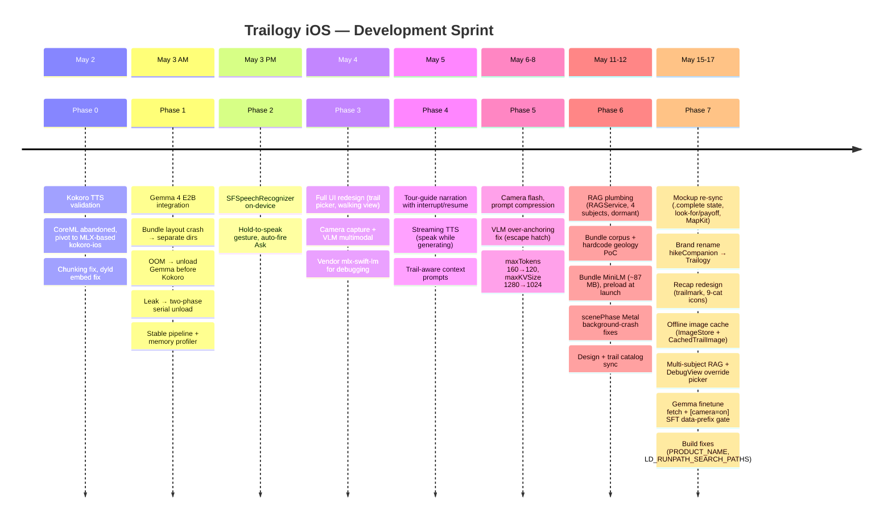
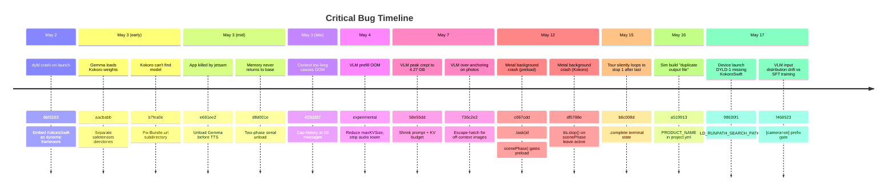

# iOS App Development Timeline

## TL;DR

- The iOS app sprint progressed from text-to-speech validation to a complete offline trail-guide experience.
- Early phases established the core loop: speech input, language-model response, and streamed speech output.
- Later phases added camera input, tour narration, prompt compression, retrieval, lifecycle crash fixes, and offline assets.
- The final phase aligned the app branding, trail UI, multi-subject retrieval, image caching, and finetuned model bundle.

## Overview

- **Duration**: 16 days.
- **Repo rename**: project was originally `hikeCompanion`; renamed to
  `Trailogy` in Phase 7 (Xcode target / bundle id / source directory
  `HikeCompanion` retained internally to avoid provisioning churn —
  display name only).

## Phase progression

## Phase 0 — Kokoro TTS validation (May 2)

**Goal**: Prove TTS can work on-device with acceptable quality.

| Commit | Description |
|---|---|
| `4eb7fd3` | Initial project: xcodegen scaffold, fetch scripts, CoreML Kokoro |
| `0c18e6b` | Pivot to MLX-based kokoro-ios |
| `32491ad` | Full TTS validation harness working |
| `15dd3d9` | Text chunking for 510-token phoneme limit |
| `6bf3103` | **Embed KokoroSwift dynamic framework** (dyld fix) |

**Key decision**: Abandoned CoreML-based Kokoro (too slow, no
streaming) in favor of MLX-based implementation that shares the Metal
runtime with Gemma.

## Phase 1 — Gemma 4 E2B integration (May 3 AM)

**Goal**: Working text → Gemma → Kokoro pipeline with stable memory.

| Commit | Description |
|---|---|
| `6917fc2` | Gemma 4 E2B first integration attempt |
| `aacbabb` | **Bundle fix**: preserve Models/Gemma/ tree (weight collision crash) |
| `b7fea0e` | Bundle.url `subdirectory: "Models"` (Kokoro lookup fix) |
| `e681ee2` | **Re-add `gemma.unload()`** between generation and TTS (jetsam fix) |
| `d8d001e` | **Two-phase serial Kokoro unload** (timing/leak fix) |
| `fa3a69b` | Kokoro status reflects "Idle" when unloaded |
| `341c666` | Memory profiler + debug view |
| `423d207` | **Cap conversation history** at 20 messages (10 turns) |

**Hardest bugs fixed**:

1. Safetensors collision — `mlx-swift-lm` globbing picked up Kokoro
   weights.
2. Jetsam — both models resident during hand-off exceeded ~5 GB.
3. Buffer leak — Kokoro ARC timing vs MLX cache clear race
   condition.

## Phase 2 — Voice input (May 3 PM)

**Goal**: Press-and-hold mic → speak → release → auto-fires Ask.

| Commit | Description |
|---|---|
| `9860567` | `SFSpeechRecognizer` integration (on-device ASR) |
| `ad11b9b` | **Hold-to-speak gesture**, auto-fires Ask on release |

**Key decision**: Apple's built-in ASR (0 MB model cost) instead of
bundling Whisper (~500 MB+).

## Phase 3 — Camera + VLM + UI redesign (May 4)

**Goal**: Multimodal image input via Gemma 4 vision tower.

| Commit | Description |
|---|---|
| `849b543` | **UI redesign** + camera integration (~6900 lines) |
| `4b82876` | **Vendor `mlx-swift-lm`** locally for VLM debugging (~68K lines) |

**Status**: VLM still experimental. App dies during first image graph
execution due to Metal JIT memory spike. Debug instrumentation added.

## Phase 4 — Tour-guide narration + polish (May 5)

**Goal**: Auto-narrating trail guide with interrupt/resume.

| Commit | Description |
|---|---|
| `459d2b1` | Tour-guide narration mode with interrupt/resume |
| `67f18ad` | **Streaming TTS** — speak chunks as Gemma generates |
| `b95d631` | Trail-aware Gemma context (per-trail system prompts) |

## Phase 5 — Prompt tuning + collaboration (May 6-8)

**Goal**: Reclaim VLM memory headroom; fix prompt-level bugs.

| Commit | Description |
|---|---|
| `cb99642` | Camera auto flash support |
| `58e55dd` | **perf: shrink prompt + KV budget** — maxTokens 160→120, maxKVSize 1280→1024, regional context trimmed |
| `736c2e2` | **fix: VLM over-anchoring** — escape-hatch sentence for off-context photos |

**Key insight (`58e55dd`)**: VLM peak had crept to ~4.27 GB after
trail-context work. Root cause: MLX intermediate activations scale
~3 MB per token in the active context window. Shrinking the prompt is
a direct memory optimization, not just a text edit.

**Key insight (`736c2e2`)**: Trail context + "don't hedge" instruction
+ regional species priors stacked into over-anchoring: show a coffee
mug and the model says "looks like a sandstone formation." Fix: one
escape-hatch sentence giving the model explicit permission to describe
off-context images literally.

## Phase 6 — RAG + design sync (May 11-12)

**Goal**: Realize the RAG path; harden against iOS background-execution
crashes that emerged once longer Kokoro narration sessions made
backgrounding-mid-speech a common path.

| Commit | Description |
|---|---|
| `ff81e57` | **RAG plumbing wired** (dormant). RAGService.swift, `gemma.ragContext` one-shot, `swift-embeddings` dep, 90-chunk corpus. |
| `d86223b` | **RAG runtime live** — bundle 4-subject corpus into `Resources/RAG/`, hardcode geology activation. |
| `8c7f377` | **Bundle MiniLM in-app (~87 MB)** + `[RAG]`/`[Gemma]` diagnostics + background preload via `ContentView.task`. Offline-from-install. |
| `c067cdd` | **fix(rag)**: `.task(id: scenePhase)` gates preload on `.active`. Prevents Metal-background crash on prewarmed launch. |
| `df5788e` | **fix(rag)**: `.onChange(of: scenePhase)` halts Kokoro on leave-`.active`. Prevents per-chunk GPU submit during user backgrounding. |
| `c39949d` | feat(trails): TrailData aligned to mockup; RAG corpus cleanup. |

**Key insight (RAG)**: tiny resident embedder + flat search was right
on the memory math but wrong on the deployment shape. First-launch HF
download is fragile (needs network, opaque failure) and the ~87 MB
embedder bundle is rounding error next to Gemma's 2.8 GB. **Ship it
bundled.**

**Key insight (scenePhase)**: iOS rejects Metal command buffer
submissions from a backgrounded app. MLX's C++ guard throws
`std::runtime_error`, which **Swift cannot catch** — process
terminates. Prevention upstream of the C++ boundary is the only fix.
See [`06-scenephase-metal-background.md`](06-scenephase-metal-background.md).

## Phase 7 — Mockup sync, brand rename, offline cache, finetune wired (May 15-17)

**Goal**: Catch the iOS app up to the upstream Trailogy-UI mockup;
rename the app; make the "download" affordance actually move bytes;
broaden RAG from hardcoded geology to per-trail multi-subject; wire
the SFT-trained Gemma 4 finetune.

| Commit | Description |
|---|---|
| `b6c008d` | **feat(walking)**: tour `.complete` terminal state — kills the silent stop-1 wraparound. |
| `ad24a57` | **feat(walking)**: look-for / payoff engagement loop — per-stop arc. |
| `8071dad` | **feat(map)**: native MapKit per trail — drops hand-coded SVG; ~10-25 MB MapKit cost off VLM hot path. |
| `937fecd` | **feat(journal)**: rewrite as Recap — Discoveries stream + Trail.learnings struct. |
| `b1ec5ab` | feat(detail): state-aware Download CTA (download → progress → Begin). |
| `8c51e85` | **feat(brand): rename display name HikeCompanion → Trailogy** (`CFBundleDisplayName` + permission strings only; bundle id / target name retained). |
| `15490c6` | tools(fetch): `fetch-gemma-finetune.sh` pulls gated HF subfolder, backs up stock model to `Models/Gemma.stock/`. |
| `2b91bac` | tools(fetch): SUBFOLDER CLI arg + wipe-on-swap. |
| `a519913` | fix(build): `PRODUCT_NAME` in project.yml (xcodegen doesn't auto-inject; sim build fails without it). |
| `98630f1` | **fix(build): `LD_RUNPATH_SEARCH_PATHS = @executable_path/Frameworks`** — device launch crash, dyld couldn't find embedded KokoroSwift.framework. |
| `0b3a2ec` | build: `-Wno-unused-const-variable` for MLX Metal kernel header noise. |
| `a66ba2c` | **feat(rag)**: per-trail subject defaults + DebugView override picker. |
| `34b53ca` | **feat(offline)**: ImageStore + CachedTrailImage — on-disk cache; ~9 MB/trail. |
| `bc020f9` | feat(gemma): system prompt names "Trailogy" + refuses on weather/news/time/GPS. |
| `f468523` | **feat(gemma): emit `[camera=on]` SFT data-prefix gate on image asks** — matches the training-time input marker. |

**Key insight (rename mechanics)**: only `CFBundleDisplayName` and a
handful of user-facing strings need to change to rename the app. The
Xcode target, scheme, source directory, App struct, and bundle id all
stay `HikeCompanion` to avoid orphaning provisioning + on-device data
+ churning every file path reference. Reversible — flip one Info.plist
string back to undo.

**Key insight (offline image cache)**: The Download CTA was always
going to need real bytes behind it. The cheap path was to back it
with an in-memory `Set<String>`. The right path was to make the disk
the persistence layer: `hasAllLocal(for:)` checks files exist;
`AppRouter.init` reseeds `downloadedTrailIDs` from disk on launch. No
UserDefaults, no migration, survives uninstall by design (because the
cache lives in Application Support which iOS clears too).

**Key insight (multi-subject RAG)**: Phase 6's hardcoded `.geology`
activation was scaffolding. The real shape is `Set<Subject>` per
trail (curator-picked) + a DebugView override for quick A/B during
testing. `setActiveSubjects` evicts loaded-but-removed subjects
rather than caching everything — keeps embedder memory bounded as
the user toggles.

**Key insight (`LD_RUNPATH_SEARCH_PATHS`)**: xcodegen 2.x doesn't
inject Xcode's default `@executable_path/Frameworks` rpath. The
framework was correctly embedded in `App.app/Frameworks/` but dyld
had no rpath that resolved to that directory, so launch failed with
`Library not loaded: @rpath/KokoroSwift.framework/KokoroSwift`. This
class of issue (project generator vs Xcode default) is invisible
until the binary actually runs on device — sim worked fine because
the simulator builds resolve through a different path.

**Key insight (`[camera=on]` SFT gate)**: the SFT pipeline trained the
finetune with an `[camera=on]` prefix on every image-bearing record.
Deploying the model without the same gate at inference time gives
the model a different input distribution than it saw at training, and
behaviour falls back toward base-like behaviour on photo asks. The
inverse `[camera=off]` is opt-in via a private static flag — only
emit it if the checkpoint was actually trained with the off-branch
active.

## Feature evolution

```mermaid
timeline
    title Product Capability Growth
    section Day 1 (May 2)
        TTS only : Type text → Kokoro speaks it aloud
    section Day 2 (May 3)
        LLM + TTS  : Type text → Gemma answers → Kokoro speaks
        Voice input : Hold mic → speak → Gemma answers → Kokoro speaks
    section Day 3 (May 4)
        Multimodal : Camera → Gemma VLM describes image → Kokoro speaks
        Full UI    : Trail picker, detail, walking mode, map
    section Day 4 (May 5)
        Narration  : Auto-narrate trail stops with interrupt/resume
        Streaming  : Hear answer while Gemma still generating
    section Day 5-7 (May 6-8)
        Memory tuning : Prompt compression saves ~700-900 MB VLM peak
        Robustness    : VLM handles off-trail photos correctly
    section Day 10-11 (May 11-12)
        Semantic recall : RAG over 4 subjects, geology PoC live
        Offline first   : MiniLM bundled (~87 MB), no first-launch download
        Background safe : scenePhase gates prevent Metal-bg crashes
    section Day 14-16 (May 15-17)
        Tour state machine : .complete terminal state + look-for/payoff arc
        Real maps          : native MapKit per trail
        Recap redesign     : Discoveries stream + 9-category icons + trailmark
        Brand              : renamed display → Trailogy + new AppIcon
        Multi-subject RAG  : per-trail defaults + DebugView override
        Offline-truly      : ImageStore — covers + stop heroes cached to disk
        Finetune wired     : Gemma 4 E2B SFT fetch + [camera=on] gate
        Offline-aware LM   : system prompt refuses on weather/news/time/GPS
```

## Critical bug archaeology

## Current status (as of May 17, 2026)

| Feature | Status |
|---|---|
| Text Ask → Gemma → Kokoro TTS | Working |
| Multi-turn conversation (3 turns) | Working |
| Hold-to-speak voice input | Working |
| Tour-guide auto-narration | Working |
| Streaming TTS (speak while generating) | Working |
| Trail-aware context prompts | Working (compressed, 3 trails) |
| Camera capture + VLM image Ask | Working (~700-900 MB peak saved) |
| VLM off-context photo handling | Working (escape-hatch fix) |
| Tour `.complete` terminal state | Working |
| Look-for / payoff engagement arc | Working |
| Native MapKit per trail | Working |
| Post-tour Recap (Discoveries stream) | Working |
| RAG retrieval (multi-subject) | Working (per-trail defaults + DebugView override) |
| Backgrounding survives mid-narration | Mostly (Kokoro halted; Gemma stream cancel unsolved) |
| Offline image cache | Working (~9 MB/trail) |
| Brand: display name "Trailogy" + AppIcon | Working |
| Gemma offline-aware system prompt | Working (refuses weather/news/time/GPS) |
| Gemma 4 E2B SFT finetune wired | Working (fetch script + `[camera=on]` gate) |
| Build (sim + device) | Working (PRODUCT_NAME + LD_RUNPATH_SEARCH_PATHS) |

## Lessons learned

1. **MLX memory is not like CPU memory** — you must explicitly clear
   the cache; ARC alone doesn't reclaim GPU buffers.
2. **Serial queue ordering matters for ARC** — local bindings in
   closures keep objects alive until closure exit. Cache operations
   must be sequenced after.
3. **Bundle layout is semantic** — a flat safetensors directory means
   the loader picks up everything. Directory separation is a
   functional requirement.
4. **On-device VLM is at the edge** — Gemma 4 VLM pushes iPhone 17
   Pro to its limits. The margin between "works" and "jetsam" is
   ~1 GB.
5. **Vendor dependencies early** — SPM exact version pins across
   uncoordinated repos are a dead end. Vendoring with relaxed ranges
   was the only viable path.
6. **Prompt length is a memory variable** — MLX intermediate
   activations scale ~3 MB per token. Trimming 100 words from the
   system prompt is a real memory optimization, not just style.
7. **Over-anchoring is a system prompt bug** — strong trail context +
   "don't hedge" + species priors stack into forcing every photo into
   the outdoor frame. Explicit escape hatches needed.
8. **Background-execution is a C++ boundary, not a Swift one** — iOS
   rejects Metal command buffer submits from a backgrounded app.
   `std::runtime_error` cannot be caught by Swift. Prevention
   upstream of the C++ call is the only fix.
9. **Bundle the small model, don't download** — MiniLM at ~87 MB is
   rounding error next to Gemma's 2.8 GB. Shipping it in the bundle
   removed an entire failure mode (first-launch HF download +
   opaque cache state) at zero meaningful disk cost.
10. **Design mockup is the source of truth, not the iOS catalog** —
    upstream HTML mockup leads; TrailData.swift follows. Each design
    resync exposes drift that needs mechanical porting.
11. **Renaming an app is one Info.plist string, not a project
    refactor** — `CFBundleDisplayName` is the only thing iOS shows
    the user. Flipping one string is reversible in seconds.
12. **Disk is the persistence layer, not UserDefaults** — for the
    offline image cache, `hasAllLocal(for:)` is the source of truth;
    `AppRouter.init` reseeds from disk on launch. No persistence
    schema to migrate.
13. **xcodegen ≠ Xcode defaults** — Xcode auto-injects
    `@executable_path/Frameworks` and `PRODUCT_NAME` for new app
    targets; xcodegen 2.x does not. Sim builds resolve through a
    different path and mask the issue; device launch crashes
    immediately. Audit every "Xcode default" assumption when a
    project generator is in the loop.
14. **Trail content authored for TTS is not the same as for reading**
    — "1928" reads inconsistently; "nineteen twenty-eight" reads
    correctly. Narration text in TrailData.swift is a TTS script,
    not prose.
15. **SFT input markers are a deployment contract, not a debugging
    artifact** — the finetune was trained with `[camera=on]`
    prepended to every image-bearing record. The deployed app MUST
    emit the same marker at inference time, or the model sees a
    different input distribution from training. Train-time prefixes
    are part of the model's interface.

## Cross-references

- Model-side pipeline produced `Models/Gemma/` for Phase 7's
  `fetch-gemma-finetune.sh`.
- Architecture: [`02-architecture-ios-app.md`](02-architecture-ios-app.md)
- Memory deep-dive: [`03-memory-management.md`](03-memory-management.md)
- Build pipeline + SPM deps: [`04-xcode-build-and-deps.md`](04-xcode-build-and-deps.md)
- RAG runtime: [`05-rag-runtime.md`](05-rag-runtime.md)
- scenePhase Metal pattern: [`06-scenephase-metal-background.md`](06-scenephase-metal-background.md)
